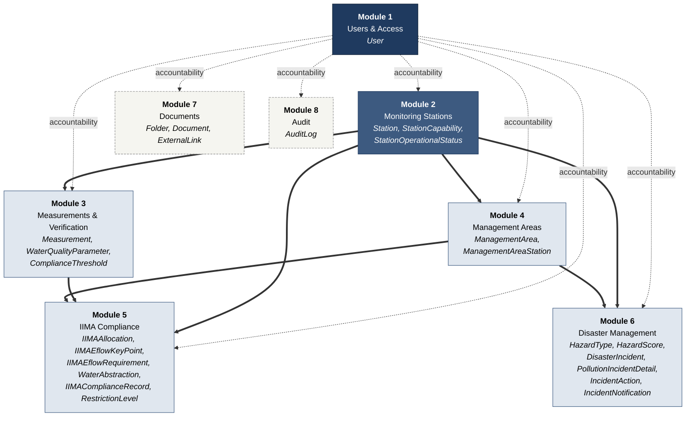
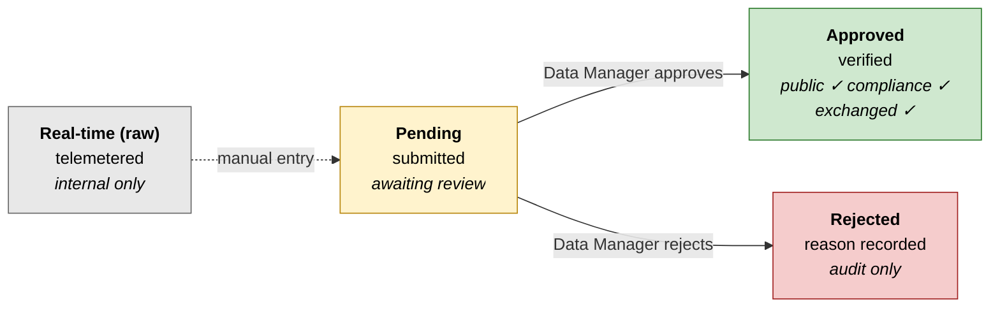
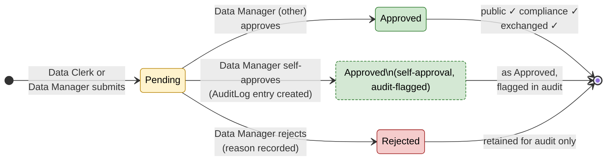
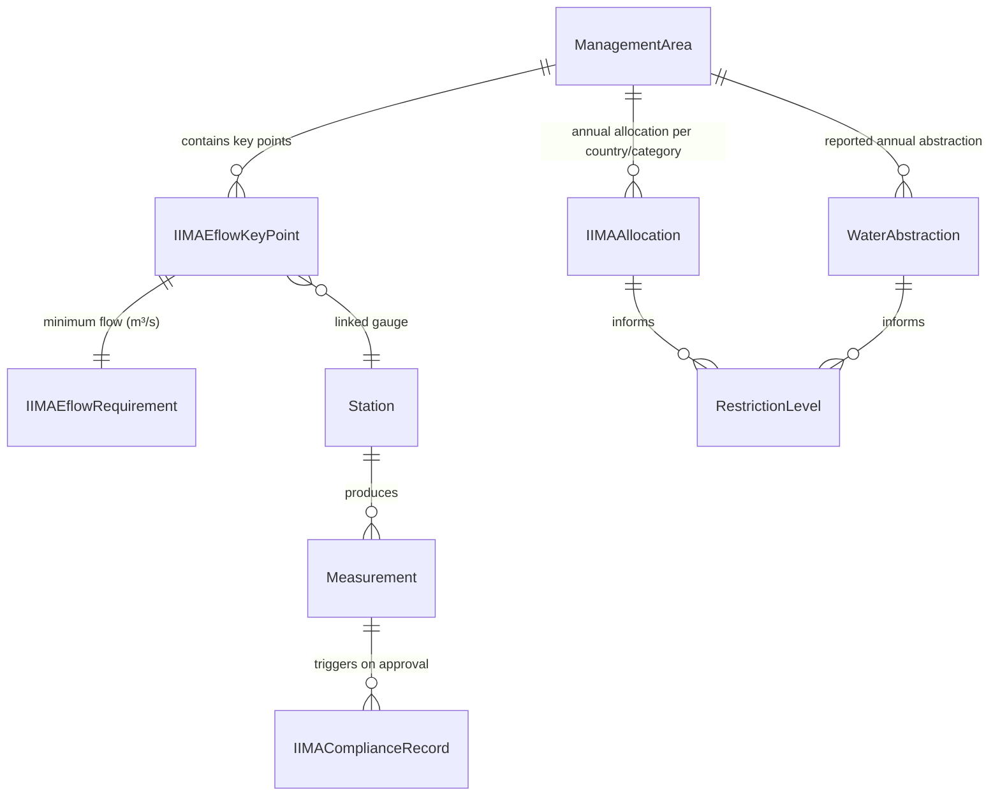
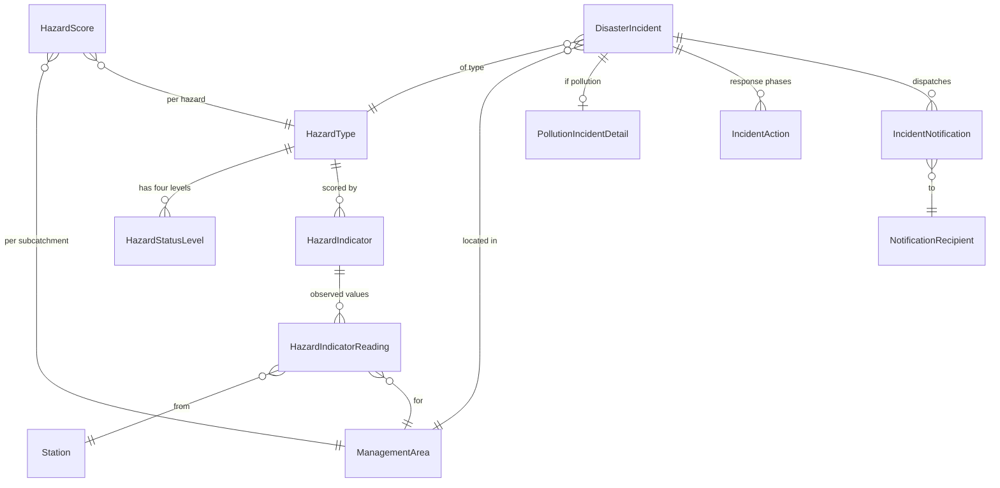
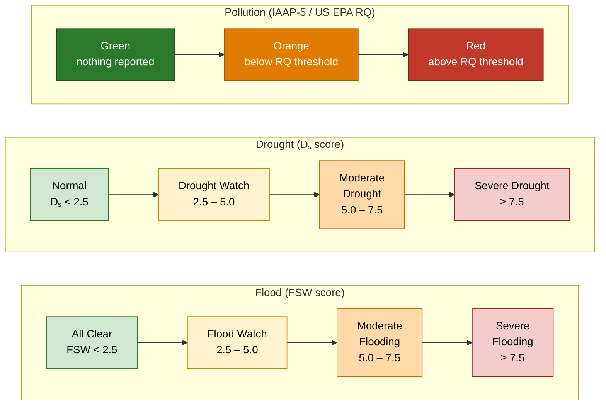

# Document Control

| Field | Value |
|---|---|
| Title | Database Design Report |
| Version | Iteration 2 / Final Draft |
| Supersedes | Iteration 1 / Draft 1 (May 2026) |
| Prepared for | Incomati and Maputo Watercourse Commission (INMACOM), operating through the Tripartite Permanent Technical Committee (TPTC) |
| Prepared by | Datamatics Eswatini |
| Lead author | Bakhombisile Siyamukela Dlamini, Systems Consultant |
| Date | May 2026 |
| Status | Final Draft, issued for INMACOM review and sign-off |
| Distribution | INMACOM Secretariat; TPTC Working Group; Country focal points (Mozambique, South Africa, Eswatini) |
| Comments due | 26 May 2026 |
| Final submission | 29 May 2026 |

# Glossary

**Comprehensive Agreement.** The Comprehensive Agreement for the Protection and Sustainable Utilisation of the Water Resources of the Incomati and Maputo Watercourses, to which the 2002 Interim IncoMaputo Agreement (IIMA) is the transitional instrument.

**Data Clerk.** A field data-entry user who may enter measurements and incident information but who cannot approve or verify any entry. Data Clerks submit readings and supporting information for review by a Data Manager.

**Data Manager.** A senior technical user who may enter, review, approve, reject or, where permitted, override data submissions. Where a Data Manager approves their own submission, the action is recorded permanently in the Audit Log.

**Database.** An organised, internally consistent collection of accessible data, with spatial attributes wherever possible. In this report the database refers to the structured Information Management System (IMS) data environment storing stations, measurements, users, compliance records, disaster incidents, documents and audit records.

**Disaster Incident.** A formally recorded flood, drought or pollution event managed through the IMS. An incident may include affected monitoring stations, management areas, response actions, notifications and supporting evidence.

**Ecological Flow.** The minimum flow that must be maintained at a key river point to support ecological functioning and treaty compliance. In the IMS, ecological-flow requirements are linked to monitoring stations so that approved flow readings can be tested against IIMA obligations.

**Hazard Indicator.** A measurable input used to assess flood, drought or pollution risk. Examples include rainfall forecasts, dam levels, river levels, soil moisture, vegetation condition, cyclone status and pollution release information.

**Information Management System (IMS).** The digital system designed to store, verify, manage and report monitoring, compliance, disaster-management and document information for INMACOM. It supports verified data use, dashboard reporting, compliance monitoring and institutional accountability.

**Interim IncoMaputo Agreement (IIMA).** The 2002 agreement establishing water-allocation entitlements, minimum ecological flows at cross-border points, and obligations for coordinated disaster response. The IMS is structured around the monitoring and compliance requirements arising from this agreement.

**Management Area.** A hydrological subcatchment used for water-resource management, disaster status reporting, IIMA allocation monitoring and compliance assessment. Management Areas are not administrative boundaries; they are operational water-management units.

**Monitoring Station.** A physical point at which water-related data are collected. Monitoring stations may include river gauges, dam sites, boreholes, rainfall stations, water-quality sampling points, lakes or wetlands.

**Pending Measurement.** A measurement submitted into the IMS but not yet reviewed and approved by an authorised Data Manager. Pending measurements do not appear on public dashboards or compliance reports until verified.

**Pollution Incident.** A recorded event involving a chemical release, waterborne disease concern, fish kill or other contamination event that may affect water quality. Pollution incidents are classified and managed through the disaster management module.

**REIWQ.** The Resolution of the TPTC on the Exchange of Information and Water Quality, signed in Maputo on 13 August 2002 alongside the IIMA. The REIWQ sets the operational obligations for transboundary data exchange and water-quality monitoring.

**Riparian State.** A country that shares, and that has rights or responsibilities over, a watercourse. The riparian states under the IIMA are Mozambique, South Africa and Eswatini.

**Station Capability.** The type or types of measurement a station can provide. A single station may support multiple capabilities — flow, dam level, rainfall, groundwater level and water quality.

**Telemetry System.** A data-transmission network allowing monitoring stations to send readings automatically or in near real time. Telemetry supports faster reporting and early warning, particularly for disaster management.

**Verified Data.** Data that have been reviewed and approved for use on dashboards, in compliance reports and in management decisions. Verified data are distinguished from unverified or pending data to protect the integrity of transboundary decision-making.

# List of Acronyms

| Acronym | Expansion |
|---|---|
| ARA-Sul | Administração Regional de Águas do Sul |
| BOD | Biochemical Oxygen Demand |
| BKS | BKS Consulting Engineers (member of the 2011 PRIMA MIS consortium) |
| CFU | Colony-Forming Units |
| CMA | Catchment Management Agency |
| COD | Chemical Oxygen Demand |
| DCP | Data Collection Platform |
| DDR | Database Design Report |
| DHI | Danish Hydraulic Institute |
| DNA | Direcção Nacional de Águas (Mozambique) |
| DO | Dissolved Oxygen |
| DSS | Decision Support System |
| Dₛ | Drought Score |
| DWA-RSA | Department of Water Affairs, South Africa |
| DWA-SW | Department of Water Affairs, Eswatini |
| EC | Electrical Conductivity |
| EPA | United States Environmental Protection Agency |
| FSC | Full Supply Capacity |
| FSW | Flood Status Weight |
| IAAP | Implementation Activity and Action Plan |
| ICDMF | Inter-Country Disaster Management Forum |
| ICMA | Inkomati Catchment Management Agency |
| IIMA | Interim IncoMaputo Agreement (2002) |
| IMS | Information Management System |
| INGC | Instituto Nacional de Gestão de Calamidades (Mozambique) |
| INMACOM | Incomati and Maputo Watercourse Commission |
| IRBM | Integrated River Basin Management |
| KOBWA | Komati Basin Water Authority |
| MNRE | Ministry of Natural Resources and Energy (Eswatini) |
| NDVI | Normalised Difference Vegetation Index |
| PRIMA | Progressive Realisation of the IncoMaputo Agreement |
| REIWQ | Resolution on the Exchange of Information and Water Quality (2002) |
| RQ | Reportable Quantity (US EPA framework) |
| RSMC | Regional Specialised Meteorological Centre |
| SADC-HYCOS | SADC Hydrological Cycle Observing System |
| SAWS | South African Weather Service |
| SRK | SRK Consulting |
| SWADE | Eswatini Water and Agricultural Development Enterprise |
| TDS | Total Dissolved Solids |
| TPTC | Tripartite Permanent Technical Committee |
| VUNWE | Vitalising, Unifying, Neighbouring Water-management Empowerment programme |

# Executive Summary

The Incomati and Maputo Watercourse Commission (INMACOM) operates in a complex transboundary environment shared by Mozambique, South Africa and Eswatini. The Commission, acting through the Tripartite Permanent Technical Committee (TPTC), is bound by the Interim IncoMaputo Agreement (IIMA) of 2002 and by the accompanying Resolution of the TPTC on the Exchange of Information and Water Quality (REIWQ) of the same year. Together these instruments require coordinated management of shared water resources, reliable bilateral and trilateral information exchange, monitoring of water use against fixed entitlements, monitoring of ecological flows at named cross-border points, and structured cooperation in response to floods, droughts and pollution incidents.

This report presents the design of the Information Management System (IMS) database supporting these responsibilities. It is the second iteration of the design and supersedes the May 2026 Draft 1. Iteration 2 retains the eight-module architecture established in Iteration 1 — which remains structurally sound — and substantially deepens the technical specification of the modules that carry the heaviest treaty load: Module 5 (IIMA Compliance) and Module 6 (Disaster Management). The deepening is driven by re-examination of the IAAP-5 (SRK Consulting, 2011) and IAAP-10 (Aurecon, 2011) reference reports, the REIWQ instrument, and the prior PRIMA Management Information System delivered under the Royal Netherlands Embassy funding by the DHI/SWECO/Consultec/BKS consortium in 2011.

The re-examination has confirmed that the prior database design correctly identifies the eight functional modules, the verification workflow, the three-role access scheme, the fifteen IIMA subcatchments, the four-level disaster alert scheme, the three-level restriction framework and the principle that surface water, groundwater and atmospheric water are independent dimensions of a station rather than mutually exclusive categories. These elements are retained verbatim in Iteration 2.

The re-examination has also identified nine specific technical gaps which Iteration 2 now closes. The Maputo Basin water-use allocations and ecological-flow key points, previously listed as outstanding inputs, are recovered from IAAP-10 Tables 5-3 and 5-4 and are now pre-loaded in the system. The flood and drought scoring framework is reproduced in full from IAAP-5, including the indicator rating ranges, the confidence weighting scheme, and the formulas for the Flood Status Weight (FSW) and Drought Score (Dₛ). The pollution classification framework is reproduced from IAAP-5 Tables 3-1, 3-2 and 3-3, including the US EPA Reportable Quantity tiers from 0.5 kg to 2,500 kg and the conservative-default rule for unlisted substances. The four-phase incident response — Situational Awareness, Resource Activation, Coordination and Demobilisation — is specified at the operational level. The inter-country notification protocol is specified by named institutional recipient per country, by transmission channel and by acknowledgement requirement. The Information Exchange Protocol is specified at the cadence prescribed by REIWQ Section 4 and Appendix G: results of sample analyses exchanged within three months, new data posted to a shared website within six months, existing data posted within twelve months, and an annual water-quality status report exchanged by each Party. The Ressano Garcia compliance point — operationally the single most critical gauge in the Incomati Basin — is correctly identified by its dual code (E-23 in the Mozambican gauge series and X2H036 in the South African series) and its IIMA minimum of 2.6 m³/s. Finally, the REIWQ Appendix A water-quality parameter values are integrated as default compliance thresholds for stations without station-specific limits, and the REIWQ Appendix E priority pollutants are seeded into the parameter registry with a priority-pollutant flag.

A new compliance-mapping section (Section 7) traces every database entity to the IIMA Article or REIWQ Section that mandates it, demonstrating that the IMS is structured by the treaty rather than retrofitted to it.

Three open inputs remain. INMACOM is requested to provide (a) the operational station registry with capability and ownership details, (b) station-specific compliance thresholds where they exist, and (c) the named focal point per country for routine and emergency notification under the ICDMF. With these inputs received, the system is ready to move from design into configured operational deployment under the schedule set out in Section 9.

The Datamatics Eswatini scope under this engagement is the foundation of the IMS: the database design specified in this report, the verification workflow, the pre-loaded IIMA and IAAP-5 reference data, and the base application — inclusive of the public-facing dashboard styling, multilingual presentation (English, Portuguese, siSwati) and the bilateral data-exchange APIs required to honour the REIWQ exchange cadence. The foundation is designed deliberately so that the broader IMS programme — carried forward by the **VUNWE** (Vitalising, Unifying, Neighbouring Water-management Empowerment) programme and by the **INMACOM hackathon** — can build on it without rework. Datamatics Eswatini intends to remain engaged as a constructive partner to VUNWE and to the hackathon participants in the pursuit of the wider programme goals of transboundary cooperation, climate resilience and equitable water sharing across Eswatini, Mozambique and South Africa. See Section 9.3 for the scope demarcation.

# 1. Background and Purpose

## 1.1 The Commission's Mandate

INMACOM, operating through the TPTC, is responsible for the joint management of shared water resources across Mozambique, South Africa and Eswatini. The mandate is given legal substance by the IIMA, signed in 2002, which establishes water-allocation entitlements per riparian state and per user category, minimum ecological flows at named cross-border measurement points, and obligations for coordinated disaster response. The mandate is operationalised by the REIWQ, also signed in 2002, which prescribes the data and information exchange obligations of the Parties for the short, medium and long term.

## 1.2 Lineage and Antecedent Work

The Progressive Realisation of the IncoMaputo Agreement (PRIMA) programme commissioned a series of implementation projects (IAAPs) to build the technical and institutional capacity needed to honour these instruments. The IMS specified in this report directly implements the data-management requirements arising from:

a. **IAAP-5**, *Disaster Management in the Incomati and Maputo Watercourses* (SRK Consulting, 2011) — establishing the three hazard types (floods, droughts, pollution), the indicator-based scoring framework, the four-level alert scheme, the US EPA-based pollution classification, the four-phase incident response and the inter-country notification protocol;

b. **IAAP-10**, *System Operating Rules* (Aurecon, 2011) — establishing the fifteen IIMA subcatchments, the water-use allocations per country and per user category (Tables 5-1 and 5-3), the ecological-flow requirements at key points (Tables 5-2 and 5-4), the three-level restriction framework (Table 5-6) and the station inventories (Tables 6-1 through 6-8); and

c. **REIWQ** — the TPTC Resolution on Exchange of Information and Water Quality, prescribing the water-quality management goals for the short term (Appendix A), the prioritised monitoring stations (Appendix B), the priority pollutants (Appendix E), the information exchange schedule by aspect and term (Appendix G), and the framework for capacity building (Appendix H).

The IMS specified here is the institutional successor to the *INMACOM Management Information System* delivered between 2008 and 2011 by the DHI/SWECO/Consultec/BKS consortium under PRIMA Project No. 11801376, funded by the Royal Netherlands Embassy. The 2011 system established the data architecture for the *Yearbook of Hydrological Data for the Incomati Basin (2007–2008)* and the joint training programme that followed. The current engagement adopts the data-exchange logic developed in 2011, modernises the database and application layers, and extends scope to the disaster-management, compliance and audit functions that the 2011 system did not cover.

## 1.3 Re-examination Findings

Iteration 1 of this DDR (May 2026) was a substantively correct architectural design. Re-examination against the IAAP and REIWQ source documents has identified nine specific technical strengthenings required for the design to meet the standard set by those source documents:

1. The flood and drought hazard scoring framework was named in Iteration 1 but not specified at the level of indicator rating tables, confidence weights and weighted-sum formulas. IAAP-5 specifies these. Iteration 2 reproduces them (see Section 6.3).

2. The pollution classification framework was named in Iteration 1 with a reference to "US EPA Reportable Quantities" but was not reproduced. IAAP-5 Tables 3-1 to 3-3 specify the categories, the reportable-quantity thresholds and the conservative-default rule. Iteration 2 reproduces them (see Section 6.4).

3. The four IAAP-5 incident-response phases — Situational Awareness, Resource Activation, Coordination, Demobilisation — were named in Iteration 1 but their entry triggers, exit triggers and required system states were not specified. Iteration 2 specifies them (see Section 6.5).

4. The inter-country notification protocol was described generically in Iteration 1 as notification to "the three countries". IAAP-5 specifies named institutional recipients per country, prescribes the channel hierarchy and requires acknowledgement. Iteration 2 specifies these (see Section 6.6).

5. The IAAP-5 finding that "hazardous pollution early-warning systems are non-existent…the most glaring gap" was not cited in Iteration 1. This finding is the operational justification for the entire pollution-incident sub-system. Iteration 2 cites it (see Section 1.4) and frames Module 6 as the direct institutional response.

6. The Maputo Basin water-use allocations and ecological-flow requirements were listed in Iteration 1 as outstanding inputs. IAAP-10 Tables 5-3 and 5-4 specify both. Iteration 2 pre-loads them (see Section 5.2 and Section 5.3).

7. The Information Exchange Protocol was described in Iteration 1 at the level of "verified versus unverified data". REIWQ Section 4 and Appendix G specify the cadence — three months for sample analyses, six months for new posted data, twelve months for existing posted data, annual reports — and IAAP-10 Section 4.1 specifies the verified-data versus real-time-data distinction. Iteration 2 specifies both (see Section 3.5).

8. The Ressano Garcia compliance point was identified in Iteration 1 by its South African gauge code (X2H036) only. The point is recorded in Mozambique as E-23 and is the single most critical operational compliance point under the IIMA. Iteration 2 records both codes and elevates the operational primacy of the point (see Section 5.3).

9. The REIWQ was referenced in Iteration 1 at the agreement level but not at the article level. Iteration 2 cites the REIWQ at the article and appendix level throughout, and provides a full compliance crosswalk (see Section 7 and Appendix C).

10. The Maputo Basin subcatchment register in Iteration 1 listed *Bivane*, *Westoe–Jericho*, *Heyshope* and *Lower Maputo* as IIMA subcatchments. These are dam-system or operational labels drawn from the Upper Usuthu and Pongola management literature; they are not the IIMA subcatchments. IAAP-10 Section 5.2.2 specifies the eight Maputo IIMA subcatchments as *Lusushwana, Mpuluzi, Usuthu, Ngwempisi, Mkhondvo, Ngwavuma, Pongola* and *Maputo*. Iteration 2 corrects the register to the IAAP-10 list, retires the four non-IIMA codes, and re-issues the four replacement codes (`MAP-NGWEMPISI`, `MAP-MKHONDVO`, `MAP-NGWAVUMA`, `MAP-MAPUTO`). The Bivane, Westoe, Jericho and Heyshope dams are retained as separate `Station` records under the relevant IIMA subcatchment, which is their correct ontological place.

11. The Incomati Basin allocation totals in Iteration 1 (basin total *≈ 2,251 Mm³/a*) and the Maputo Basin allocation totals (reported as *≈ 1,499 Mm³/a*) were carried forward from informal estimates. The IAAP-10 published totals are **2,251 Mm³/a** for the Incomati Basin and **1,697 Mm³/a** for the Maputo Basin. The Iteration 2 tables reproduce IAAP-10 Tables 5-1 and 5-3 in full, including the four-way split of First Priority / Irrigation / Afforestation per country, and the two reserved allocations of 87.6 Mm³/a each for the City of Maputo (one from each basin).

## 1.4 The "Glaring Gap" — Justification for Module 6

The IAAP-5 report (SRK Consulting, 2011) identifies as its most consequential finding that "hazardous pollution early-warning systems are non-existent in the two basins, and the absence of these constitutes the most glaring gap in the disaster-management arrangements for the Incomati and Maputo watercourses". This finding is the operational rationale for Module 6 (Disaster Management) and for the choice to integrate the pollution-incident sub-system into the same verification workflow as routine measurements. Iteration 2 is explicit on this point: the disaster module is not a peripheral feature; it is the closing of the identified gap.

## 1.5 Purpose of This Report

This report specifies, at the level of technical and operational detail required for configured deployment, what the IMS database stores, what design decisions were taken in arriving at that specification, and what residual information INMACOM is required to provide before operational handover. It is written for the engineers, hydrologists, water-quality specialists and institutional representatives who will populate, operate and govern the system. It is not a programming reference; database-level implementation artefacts (DDL scripts, ER diagrams at the table level, API definitions) are maintained separately.

# 2. Design Philosophy

The IMS design rests on five non-negotiable principles. Principles 2.1 to 2.4 were established in Iteration 1 and are retained. Principle 2.5 is added in Iteration 2 to acknowledge the institutional lineage of the system.

## 2.1 Every Reading Must Be Verified Before It Is Used

All measurements — dam level, river flow, rainfall total, groundwater depth, water-quality sample — enter the system in a *pending* state. Measurements become available for public dashboards, compliance reports and management decisions only after review and approval by a Data Manager. This mirrors the Information Exchange Protocol of IAAP-10 Section 4.1, which distinguishes "unverified real-time data" from "verified data", and operationalises the REIWQ Section 3.3.2 requirement that exchanged data have been subject to suitable evaluation techniques before exchange. The verification gate is not bureaucratic friction; it is the principal mechanism by which the integrity of transboundary decisions is protected. Rejected entries are preserved with the reason recorded, creating a permanent and reviewable history.

## 2.2 Three Levels of Access

Three institutional roles are defined. Unauthenticated public dashboard viewers form an implicit fourth tier and see only verified data.

| Role | Held by | Capabilities |
|---|---|---|
| Admin | System Administrator | Full access. May manage users, override any approval (override recorded in the Audit Log), and configure system reference data. |
| Data Manager | Senior technical staff in each country | Enter measurements and incidents, approve or reject submissions by other staff, approve own submissions only via an audit-logged override. |
| Data Clerk | Field data-entry staff | Enter measurements and incidents only. May not approve any entry, including their own. |

## 2.3 Surface Water, Groundwater and Atmosphere Are Independent Dimensions

The 2011 PRIMA database recorded a station's nature as a single discriminator (dam, flow, water quality, and so on). A station that produced both flow and water-quality readings, or a borehole producing both depth and quality readings, had to be duplicated. This was operationally incorrect and analytically misleading. The redesigned system records two independent attributes for every station:

a. the **water source** — `surface`, `ground` or `atmospheric`; and
b. one or more **station capabilities** — `dam_level`, `flow`, `rainfall`, `water_quality`, `groundwater_level`, and others as required.

A single physical station carries a single record with multiple capability entries. Boreholes sampled for both depth and quality, dams sampled for both level and quality, and river gauges sampled for both flow and water quality are now correctly represented.

## 2.4 The System Is Built on the IIMA, Not Retrofitted to It

The fifteen IIMA subcatchments are pre-loaded. The IIMA water-use allocations for both basins are pre-loaded. The IIMA ecological-flow minima at all nineteen named key points (nine Incomati, ten Maputo) are pre-loaded. The IIMA three-level restriction framework is encoded. The cross-border compliance point at Ressano Garcia is pre-linked to its dual gauge identifier (E-23 ‖ X2H036). When an approved flow reading is entered at any compliance-linked station, the IMS compares it against the relevant IIMA minimum without manual computation. Section 7 provides the entity-to-article compliance crosswalk demonstrating this.

## 2.5 The System Acknowledges Its Lineage

Three institutional moments precede the present engagement and shape its design.

a. **The 2011 PRIMA Management Information System** (Project 11801376, DHI/SWECO/Consultec/BKS, funded by the Royal Netherlands Embassy) developed the data-exchange logic that underwrites the REIWQ obligations, the joint annual hydrological yearbook concept and the categorisation of monitoring stations into prioritised tiers. That platform did not endure as an operational system; it is referenced in the present design for the conceptual material it produced, not as a live antecedent.

b. **The current INMACOM platform at *inmacom.net*** was developed and delivered by Datamatics Eswatini and handed over to the Commission on completion. The platform is a substantive institutional asset and the proper starting point for the present re-examination.

c. **The intervening years saw the platform underutilised.** Knowledge of the system concentrated in a small number of staff; those staff moved on; their successors were not trained against the platform; routine data updates were not made; and the system, while it persisted, drifted out of operational use. This is not a fault of the platform's design but of the institutional knowledge-management environment around it, and the present engagement is structured to leave INMACOM with a platform that is harder to silo: documentation as a deliverable, an enforced verification workflow that exposes who knows what about the data, a public dashboard that makes underutilisation visible, and a treaty-anchored data load that is meaningful from day one.

The acknowledgement is explicit because honest lineage is itself a design value in a transboundary engagement. The Commission and the three Parties recognise both the 2011 effort and the current platform; the IMS specified in this report positions itself as the deliberate revitalisation of the latter, informed by the former.

# 3. Database Architecture

## 3.1 Architectural Overview

The IMS database is organised into eight functional modules. Every module has at least one entity referencing the User registry (Module 1) for accountability and at least one entity referencing the Station registry (Module 2) for geographical anchoring, except for the Document and Audit modules. The relationships among modules are summarised below.

| Module | Primary entities | Principal references |
|---|---|---|
| 1. Users & Access | `User` | (referenced by all other modules) |
| 2. Monitoring Stations | `Station`, `StationCapability`, `StationOperationalStatus` | `User` (status reports) |
| 3. Measurements & Verification | `Measurement`, `WaterQualityParameter`, `ComplianceThreshold` | `Station`, `User` |
| 4. Management Areas | `ManagementArea`, `ManagementAreaStation` | `Station` |
| 5. IIMA Compliance | `IIMAAllocation`, `IIMAEflowRequirement`, `IIMAEflowKeyPoint`, `WaterAbstraction`, `IIMAComplianceRecord`, `RestrictionLevel` | `ManagementArea`, `Station`, `User` |
| 6. Disaster Management | `HazardType`, `HazardStatusLevel`, `HazardIndicator`, `HazardIndicatorReading`, `HazardScore`, `DisasterIncident`, `PollutionIncidentDetail`, `IncidentAction`, `IncidentNotification`, `NotificationRecipient` | `ManagementArea`, `Station`, `User` |
| 7. Documents | `Folder`, `Document`, `ExternalLink` | `User` |
| 8. Audit | `AuditLog` | `User` |

**Figure 3.1 — Module dependency map.** *Foundation modules (Users, Stations) anchor every operational module; cross-cutting modules (Documents, Audit) are referenced by all.*

Appendix B provides the consolidated Database Overview Diagram.

## 3.2 Data-Type Discipline

All identifiers are stored as natural codes wherever the source instrument (IIMA, REIWQ, IAAP-10 station inventories) provides one. Subcatchment codes (`INC-KOMATI`, `MAP-USUTHU`) and gauge codes (`X2H036`, `E-23`, `GS-30`) are reproduced verbatim from source documents and are treated as immutable primary keys for the corresponding records. This discipline ensures that bilateral correspondence between national agencies and the IMS uses a single shared vocabulary.

## 3.3 Date and Time Discipline

All timestamps are stored in UTC with explicit timezone offsets recorded for displayed values. Measurement dates are stored at the precision provided by the source (date-only for daily sample logs, date-and-time for continuous-recording gauges). Disaster-incident timestamps record the event time, the report time, the approval time and, where applicable, the notification-acknowledgement time as four distinct fields.

## 3.4 Spatial Reference Discipline

All geographic coordinates are stored as decimal degrees in WGS-84. Negative latitudes denote southern hemisphere; positive longitudes denote eastern hemisphere. Where source documents provide coordinates in degrees-minutes-seconds or in projected coordinates (e.g. UTM Zone 36S), the IMS records both the converted WGS-84 value and the source reference for traceability.

## 3.5 Verified versus Unverified Data Streams

Following IAAP-10 Section 4.1 and REIWQ Section 3.3.2 the IMS distinguishes four data states. All routine entries follow the path `pending → approved` or `pending → rejected`. The four states are summarised below.

| State | Source | Visible on public dashboard | Used for compliance check | Available to Parties via REIWQ exchange |
|---|---|---|---|---|
| Real-time (raw) | Telemetered gauge | No | No | No |
| Pending | Submitted by Data Clerk or Data Manager | No | No | No |
| Approved | Reviewed and approved by Data Manager | Yes | Yes | Yes |
| Rejected | Reviewed and rejected by Data Manager (with reason) | No | No | No (but retained for audit) |

**Figure 3.5 — Data state transitions.** *Only `approved` data is public, used for compliance, and exchanged with the Parties.*

The REIWQ Section 4 exchange cadence applies to *approved* data only:

a. results of sample analyses are exchanged within **three months** of analysis (REIWQ Section 3.3.2(b));

b. *new* data are posted to the shared website within **six months** of finalisation (REIWQ Section 4.3);

c. *existing* data are posted to the shared website within **twelve months** of signing of the Resolution (REIWQ Section 3.3.2(d), Section 4.5);

d. an **annual report** on water-quality status at each monitoring station is exchanged by each Party (REIWQ Section 3.3.2(f)); and

e. rainfall data from the stations listed in REIWQ Appendix C are exchanged on the same cadence (REIWQ Section 4.4).

Appendix D reproduces the REIWQ Appendix G information-exchange schedule as a single matrix of aspect × term × dataset × custodian × format × frequency.

# 4. Module Specifications

The eight modules are specified below. Each subsection follows a uniform structure: *Purpose · Entities · Key fields · Relationships · Pre-loaded data · Workflows · Compliance hooks · Outstanding inputs*. Module 5 (IIMA Compliance) and Module 6 (Disaster Management) are substantially expanded relative to Iteration 1.

## 4.1 Module 1 — Users and Access Control

**Purpose.** Every user of the system has a `User` record. This record is the anchor for all accountability: every measurement, every approval, every override, and every disaster response action is permanently linked to the user who performed it.

**Entity — `User`.**

| Field | Type | Description |
|---|---|---|
| `id` | UUID | Internal identifier |
| `display_name` | string | Full name as displayed in the system |
| `email` | string, unique | Login email; used for authentication and notifications |
| `role` | enum | `Admin`, `Data Manager` or `Data Clerk` |
| `country` | enum | `Mozambique`, `South Africa` or `Eswatini` |
| `organisation` | string | Employing institution (e.g. ARA-Sul, DWA-RSA, KOBWA, DNA, SWADE, ICMA, MNRE) |
| `created_at` | timestamp | Account creation date, set automatically |
| `last_login_at` | timestamp | Most recent successful authentication |
| `is_active` | boolean | Soft-disable flag; preserves audit references when staff depart |

**Workflows.** User creation, role assignment and deactivation are Admin-only actions. Role changes are recorded in the Audit Log. Deactivated users retain their references in historical records.

**Outstanding inputs.** A list of staff who will use the system, with name, email, organisation, country and intended role.

## 4.2 Module 2 — Monitoring Stations

**Purpose.** The `Station` registry is the geographical and operational backbone of the system. Every measurement and every operational status event is linked to a station record.

**Entity — `Station`.**

| Field | Type | Description |
|---|---|---|
| `code` | string, unique | Official gauge code (e.g. `X2H036`, `GS-30`, `E-23`) |
| `alt_code` | string, nullable | Alternative national code for cross-border gauges (e.g. `E-23` is `X2H036` in the RSA series) |
| `name` | string | Descriptive name |
| `latitude` | decimal | Decimal degrees, negative for south |
| `longitude` | decimal | Decimal degrees, positive for east |
| `water_source` | enum | `surface`, `ground` or `atmospheric` |
| `water_body_type` | enum | `river`, `dam`, `borehole`, `rainfall_station`, `lake`, `wetland` |
| `is_real_time` | boolean | Whether the station transmits readings automatically |
| `owner_organisation` | string | Owning institution |
| `country` | enum | Riparian state in which the station is located |
| `river_basin` | enum | `Incomati` or `Maputo` |
| `telemetry_system` | string, nullable | Data-transmission network (e.g. `KOBWA`, `SADC-HYCOS`, `DWA-RSA`) |
| `is_early_warning` | boolean | Whether the station forms part of the IAAP-5 early-warning network |
| `is_iima_compliance_point` | boolean | Whether the station is linked to an IIMA ecological-flow key point |
| `reiwq_priority_tier` | integer, nullable | Priority tier from REIWQ Appendix B (where listed) |

**Entity — `StationCapability`.** A station may carry one or more capabilities. Each capability is a separate record referencing the station.

| Field | Type | Description |
|---|---|---|
| `station_id` | FK → `Station` | Station to which this capability belongs |
| `capability` | enum | `dam_level`, `flow`, `rainfall`, `water_quality`, `groundwater_level` |

**Entity — `StationOperationalStatus`.** IAAP-5 identifies downtime of monitoring stations as a critical weakness in the early-warning system. The IMS records a log of operational status events.

| Field | Type | Description |
|---|---|---|
| `station_id` | FK → `Station` | Station to which this status event applies |
| `status` | enum | `operational`, `degraded`, `offline` |
| `reported_at` | timestamp | When the status change was reported |
| `restored_at` | timestamp, nullable | When the station returned to `operational` (if applicable) |
| `reported_by` | FK → `User` | Who reported the change |
| `reason` | text | Free-text reason (e.g. flood damage, telemetry failure, scheduled maintenance) |

**Pre-loaded data.** IAAP-10 Section 3.3.5 inventories the Incomati monitoring network at **84 storage/stage/flow stations identified as key monitoring sites, of which 33 collect and transmit data in real time**. IAAP-10 Section 3.3.5 also notes approximately 200 operational rainfall stations in the Incomati Basin. The corresponding real-time count for the Maputo Basin is not stated as a single figure in IAAP-10 and is recorded in the IMS as a derived count from the `is_real_time` flag once the operational register is loaded.

**Cross-border dual-code map (initial).** For stations that appear under two national codes, both are recorded.

| Mozambican code | RSA / Eswatini code | River | Notes |
|---|---|---|---|
| E-23 | X2H036 | Incomati at Ressano Garcia | Critical IIMA compliance point; SADC-HYCOS station |
| E-413 | — | Drift Confluencia | Mozambique-only |
| E-630 | — | Corumana Dam (upstream) | Mozambique-only |
| E-634 | — | Corumana Dam (downstream) | Mozambique-only |
| — | X1H001 | Hooggenoeg (SADC-HYCOS) | RSA-only |
| — | X1H049 | Driekoppies Dam outflow | RSA-only |
| — | X3H015Q01 | Sabie | RSA-only |
| — | X2H016Q01 | Crocodile | RSA-only |
| — | GS-30 | Mananga | Eswatini |
| — | GS-34 | Matsamo | Eswatini |

Additional dual-code mappings will be added as INMACOM confirms the operational register.

**Outstanding inputs.** The full operational station register — see Section 6 for the spreadsheet schema.

## 4.3 Module 3 — Measurements and the Verification Workflow

**Purpose.** All water-measurement data — dam levels, river flows, rainfall, water-quality samples and groundwater depths — are stored in a single `Measurement` registry. The `measurement_type` field distinguishes among them. This single-registry design supports the verification workflow uniformly across all measurement types.

**Entity — `Measurement`.**

| Field | Type | Description |
|---|---|---|
| `station_id` | FK → `Station` | Source station |
| `measurement_type` | enum | `dam_level`, `flow`, `rainfall`, `water_quality`, `groundwater_level` |
| `parameter_code` | FK → `WaterQualityParameter`, nullable | Used for water-quality measurements only |
| `value` | decimal | Numeric measurement |
| `unit` | string | Unit (e.g. `m³/s`, `mm`, `mg/L`, `pH units`, `m`) |
| `fsc_mm3` | decimal, nullable | Full Supply Capacity (Mm³); used for dam-level percentage computation |
| `measured_at` | timestamp | When the measurement was taken |
| `status` | enum | `pending`, `approved`, `rejected` |
| `submitted_by` | FK → `User` | Who entered the reading |
| `reviewed_by` | FK → `User`, nullable | Who approved or rejected it |
| `reviewed_at` | timestamp, nullable | When the review took place |
| `review_notes` | text, nullable | Reason if rejected; optional note if approved |
| `is_self_approval` | boolean | True if `submitted_by` = `reviewed_by`; triggers an `AuditLog` entry |

**Entity — `WaterQualityParameter`.** A controlled list of parameters; see Appendix A for the full pre-loaded set.

| Field | Type | Description |
|---|---|---|
| `code` | string, unique | Short code (e.g. `pH`, `COD`, `E coli`, `NO2+NO3`, `Cr6`) |
| `name` | string | Full name |
| `default_unit` | string | Default measurement unit |
| `description` | text | Short technical description |
| `is_reiwq_appendix_a` | boolean | Whether the parameter appears in REIWQ Appendix A |
| `is_priority_pollutant` | boolean | Whether the parameter appears in REIWQ Appendix E |
| `reiwq_general_identification` | string, nullable | The 1/2/3/4 identification code from REIWQ Appendix A footnote |

**Entity — `ComplianceThreshold`.** For each station, acceptable ranges per measurement type. For water-quality measurements, thresholds are per parameter per station. Where no station-specific threshold is recorded, the IMS falls back to the REIWQ Appendix A guideline value for parameters that appear in that appendix.

| Field | Type | Description |
|---|---|---|
| `station_id` | FK → `Station` | Station to which the threshold applies |
| `measurement_type` | enum | Measurement type |
| `parameter_code` | FK → `WaterQualityParameter`, nullable | For water-quality thresholds |
| `min_value` | decimal, nullable | Lower bound (omitted if no minimum) |
| `max_value` | decimal, nullable | Upper bound (omitted if no maximum) |
| `unit` | string | Unit of the threshold |
| `basis` | text | Justification (e.g. "IIMA Article 6 minimum cross-border flow"; "REIWQ Appendix A short-term guideline value") |

**Verification workflow.**

**Figure 4.3 — Measurement verification state machine.**

**Compliance hooks.** Each approved measurement is checked against the relevant `ComplianceThreshold`. The dashboard colour code is `green` (within range), `amber` (within 10 % of a threshold) or `red` (out of range). For flow measurements at IIMA ecological-flow key points, the IIMA minimum is the compliance threshold; any reading below this value is flagged red and triggers an IIMA non-compliance record.

**Outstanding inputs.** Station-specific compliance thresholds where they exist (see Section 6.3).

## 4.4 Module 4 — Management Areas and IIMA Subcatchments

**Purpose.** The `ManagementArea` registry holds the operational sub-areas used for water-resource management and disaster-status reporting. These are not administrative boundaries; they are the hydrological subcatchments defined in IAAP-10 for the purpose of applying the IIMA's water-use allocations and ecological-flow requirements.

**Entity — `ManagementArea`.**

| Field | Type | Description |
|---|---|---|
| `code` | string, unique | Subcatchment code (e.g. `INC-KOMATI`) |
| `name` | string | Descriptive name |
| `basin` | enum | `Incomati` or `Maputo` |
| `countries` | array of enum | Riparian states with territory in the subcatchment |

**Entity — `ManagementAreaStation`.** Many-to-many junction linking stations to subcatchments.

**Pre-loaded data — the fifteen IIMA subcatchments** *(Source: IAAP-10 Section 5.2.1 and Section 5.2.2.)*

| Code | Name | Basin | Countries |
|---|---|---|---|
| `INC-KOMATI` | Komati | Incomati | South Africa, Eswatini, Mozambique |
| `INC-CROCODILE` | Crocodile | Incomati | South Africa, Mozambique |
| `INC-SABIE` | Sabie | Incomati | South Africa, Mozambique |
| `INC-MASSINTONTO` | Massintonto | Incomati | South Africa, Mozambique |
| `INC-UANETZE` | Uanetze | Incomati | South Africa, Mozambique |
| `INC-MAZIMECHOPES` | Mazimechopes | Incomati | Mozambique |
| `INC-INCOMATI` | Lower Incomati (mainstem below Sabie confluence) | Incomati | Mozambique, South Africa |
| `MAP-LUSUSHWANA` | Lusushwana | Maputo | Eswatini |
| `MAP-MPULUZI` | Mpuluzi | Maputo | South Africa, Eswatini |
| `MAP-USUTHU` | Usuthu | Maputo | South Africa, Eswatini, Mozambique |
| `MAP-NGWEMPISI` | Ngwempisi | Maputo | South Africa, Eswatini |
| `MAP-MKHONDVO` | Mkhondvo | Maputo | South Africa, Eswatini |
| `MAP-NGWAVUMA` | Ngwavuma | Maputo | South Africa, Eswatini, Mozambique |
| `MAP-PONGOLA` | Pongola | Maputo | South Africa, Eswatini, Mozambique |
| `MAP-MAPUTO` | Maputo (Lower) | Maputo | Mozambique |

Note (Iteration 2 correction). The Iteration 1 subcatchment list for the Maputo Basin (`MAP-BIVANE`, `MAP-WEST-JERICHO`, `MAP-HEYSHOPE`, `MAP-LOWER`) confused dam-system labels with IIMA subcatchments. Bivane is a tributary in the Pongola subcatchment; the Westoe, Jericho and Heyshope dams are operational features within the Upper Usuthu and Pongola subcatchments. The four labels are retired as subcatchment codes; the dams themselves are retained as `Station` records under their correct IIMA subcatchments. See Section 1.3, finding 10.

**Outstanding inputs.** Assignment of boundary stations to their management areas where ambiguous.

## 4.5 Module 5 — IIMA Compliance

**Purpose.** Module 5 is the treaty-accountability backbone. It translates the legal obligations of the IIMA into data structures that can be monitored in near real time and reported on a fixed cadence.

### 4.5.1 Entities

| Entity | Description |
|---|---|
| `IIMAAllocation` | Annual water-use allocation per subcatchment, per country, per user category, in Mm³/a |
| `IIMAEflowKeyPoint` | Named ecological-flow key point on a river, with its IIMA minimum and its linked gauge |
| `IIMAEflowRequirement` | Minimum flow obligation at a key point, in m³/s, with optional seasonal modulation |
| `WaterAbstraction` | Reported actual annual water use per subcatchment, per country, per user category |
| `IIMAComplianceRecord` | Computed record stating whether an obligation is met for a given period |
| `RestrictionLevel` | The three-level IIMA restriction framework |

**Figure 4.5.1 — Module 5 entity relationships.**

### 4.5.2 Pre-loaded data — Incomati Basin allocations

*(Source: IAAP-10 Table 5-1, reproduced verbatim. All values in Mm³/a.)*

| Subcatchment | MZ First Priority | MZ Irrigation | MZ Afforestation | RSA First Priority | RSA Irrigation | RSA Afforestation | SW First Priority | SW Irrigation | SW Afforestation | Total |
|---|---:|---:|---:|---:|---:|---:|---:|---:|---:|---:|
| Komati | — | — | — | 183 | 381 | 99 | 22 | 261 | 46 | **992** |
| Crocodile | — | — | — | 73 | 307 | 247 | — | — | — | **627** |
| Sabie | 0.5 | 12.0 | 0 | 80 | 98 | 129 | — | — | — | **320** |
| Massintonto | 0.7 | 0 | 0 | 0.3 | 0 | 0 | — | — | — | **1** |
| Uanetze | 0.6 | 0 | 0 | 0.3 | 0 | 0 | — | — | — | **1** |
| Mazimechopes | 0.5 | 0 | 0 | — | — | — | — | — | — | **1** |
| Incomati (Lower) | 16.7 | 268 | 25 | — | — | — | — | — | — | **310** |
| **Country sub-total** | **19** | **280** | **25** | **336.6** | **786** | **475** | **22** | **261** | **46** | **2,251** |

*Note (IAAP-10 footnote to Table 5-1). A first-priority allocation of up to 87.6 Mm³/a from the Incomati Basin is reserved for the City of Maputo in the IIMA; this reservation is held outside the per-subcatchment totals above and is carried at basin level in the IMS. Realisation of this reservation requires further water-resource development in the basin.*

Reading the totals: South Africa holds **1,597.6 Mm³/a** (71 %), Eswatini holds **329 Mm³/a** (15 %), Mozambique holds **324 Mm³/a** (14 %). The asymmetry reflects the upstream concentration of irrigated agriculture and afforestation in the South African headwaters of the Komati, Crocodile and Sabie systems and is the primary structural reason that the Ressano Garcia cross-border minimum of 2.6 m³/s is operationally so consequential.

### 4.5.3 Pre-loaded data — Maputo Basin allocations

*(Source: IAAP-10 Table 5-3, reproduced verbatim. All values in Mm³/a.)*

| Subcatchment | MZ First Priority | MZ Irrigation | MZ Afforestation | RSA First Priority | RSA Irrigation | RSA Afforestation | SW First Priority | SW Irrigation | SW Afforestation | Total |
|---|---:|---:|---:|---:|---:|---:|---:|---:|---:|---:|
| Lusushwana | — | — | — | 1 | 0.2 | 7 | | | | |
| Mpuluzi | — | — | — | 6 | 0.8 | 37 | | | | |
| Usuthu | — | — | — | 38 | 0 | 14 | 39.4 | 462 | 80 | **975** |
| Ngwempisi | — | — | — | 60 | 4.8 | 52 | | | | |
| Mkhondvo | — | — | — | 117 | 13.9 | 42 | | | | |
| Ngwavuma | — | — | — | 2 | 1.3 | 0 | 2.6 | 58.6 | 1.5 | **66** |
| Pongola | — | — | — | 18 | 517 | 46 | 2 | 6.4 | 0.5 | **590** |
| Maputo | 6 | 60 | 0 | — | — | — | — | — | — | **66** |
| **Country sub-total** | **6** | **60** | **0** | **242** | **538** | **198** | **44** | **527** | **82** | **1,697** |

*Note (IAAP-10 footnote to Table 5-3). A first-priority allocation of up to 87.6 Mm³/a from the Maputo Basin is reserved for the City of Maputo in the IIMA; this reservation is held outside the per-subcatchment totals above and is carried at basin level in the IMS. Realisation of this reservation requires further water-resource development in the basin.*

Reading the totals: South Africa holds **978 Mm³/a** (58 %), Eswatini holds **653 Mm³/a** (38 %), Mozambique holds **66 Mm³/a** (4 %). The Eswatini share is dominated by the Usuthu Irrigation allocation of 462 Mm³/a, which underwrites the Lower Usuthu Smallholder Irrigation Project (LUSIP) and the Big Bend Irrigation Scheme. The Mozambican share is concentrated in the Maputo subcatchment downstream of the Pongola confluence at Ndumo.

### 4.5.4 Pre-loaded data — Incomati ecological-flow key points

*(Source: IAAP-10 Table 5-2, reproduced verbatim.)*

| Key point | River | Mean (Mm³/a) | IIMA minimum (m³/s) | Linked gauge | Notes |
|---|---|---:|---:|---|---|
| Lower Sabie | Sabie | 200 | 0.6 | X3H021 | Compliance-monitoring gauge per IAAP-10 Section 5.5.2 |
| Incomati River (Sabie–Incomati confluence) | Sabie | 200 | 0.6 | (to confirm) | |
| Tenbosch | Crocodile | 245 | 1.2 | X2H016 (to confirm) | IAAP-10 Section 5.5.2 proportioning rule references 1.17 m³/s at Ten Bosch |
| Diepgezet | Komati | 190 | 0.6 | (to confirm) | Upstream Komati point |
| Mananga | Komati | 200 | 0.9 | GS-30 | Eswatini |
| Lebombo | Komati | 42 | 1.0 | (to confirm) | IAAP-10 Section 5.5.2 references 1.43 m³/s downstream of confluence |
| **Ressano Garcia** | **Incomati** | **290** | **2.6** | **E-23 ‖ X2H036** | **Cross-border compliance point; SADC-HYCOS station; single most critical IIMA gauge** |
| Sabie–Incomati downstream | Incomati | 290 | 2.6 | (to confirm) | |
| Marracuene | Incomati | 450 | 3.0 | (to confirm) | Downstream monitoring point near the estuary |

### 4.5.5 Pre-loaded data — Maputo ecological-flow key points

*(Source: IAAP-10 Table 5-4, reproduced verbatim.)*

| Key point | River | Mean (Mm³/a) | IIMA minimum (m³/s) | Linked gauge | Notes |
|---|---|---:|---:|---|---|
| **Salamanga** | **Maputo** | **840** | **2.7** | **E-4** | **Mozambique cross-border compliance point; most consequential Maputo Basin gauge** |
| Ndumo | Pongola | 300 | 0.8 | (to confirm) | RSA – Mozambique border on Pongola |
| At the border | Ngwavuma | 50 | 0.1 | (to confirm) | Eswatini – Mozambique border on Ngwavuma |
| Mkhondvo at GS-25 | Mkhondvo | 35 | 0.1 | GS-25 | Eswatini |
| Hlelo at GS-22 | Hlelo | 35 | 0.1 | GS-22 | Eswatini |
| Ngwempisi at GS-21 | Ngwempisi | 30 | 0.1 | GS-21 | Eswatini |
| Usuthu at GS-23 | Usuthu | 20 | 0.1 | GS-23 | Eswatini |
| **Big Bend** | **Usuthu** | **520** | **1.7** | **GS-16** | **Eswatini; IAAP-10 recommends GS-16 be real-time-enabled to improve flood warning to Mozambique** |
| Dumbarton | Mpuluzi | 65 | 0.1 | (to confirm) | |
| Lusushwana at GS-33 | Lusushwana | 35 | 0.1 | GS-33 | Eswatini |

### 4.5.6 Pre-loaded data — restriction-level framework

*(Source: IAAP-10 Table 5-6.)*

| Restriction level | Strategic (1st priority) | Urban / Industrial (1st priority) | Irrigation |
|---|---:|---:|---:|
| Level 1 | 0 % | 0 % | up to 30 % |
| Level 2 | 0 % | up to 5 % | up to 40 % |
| Level 3 | 0 % | up to 20 % | up to 70 % |

The IMS computes the applicable restriction level per subcatchment per assessment period from the ratio of `WaterAbstraction.value` to `IIMAAllocation.value` and from observed ecological-flow performance at the relevant key points.

### 4.5.7 Workflows

a. *Water-use reporting.* Each Party reports annual abstraction per subcatchment, per country, per user category. Reports follow the same `pending → approved` workflow as measurements.

b. *Compliance computation.* On approval of a flow measurement at a station linked to an `IIMAEflowKeyPoint`, the system creates an `IIMAComplianceRecord` with the observed value, the IIMA minimum, the compliance status (`met`, `breached`) and a timestamp. Compliance records are read-only.

c. *Restriction-level escalation.* When abstraction in a subcatchment approaches an allocation limit, or when ecological-flow breaches occur with defined frequency, the system raises the applicable restriction level and notifies the relevant Data Managers. The escalation is a recommendation; activation of restrictions remains an institutional decision.

### 4.5.8 Outstanding inputs

a. Gauge-to-key-point linkages for the Incomati key points marked *(to confirm)* in Section 4.5.4.

b. Gauge-to-key-point linkages for the Maputo key points marked *(to confirm)* in Section 4.5.5.

c. Confirmation that the Iteration 2 IIMA subcatchment correction (Section 1.3 finding 10) is accepted and that the four retired codes (`MAP-BIVANE`, `MAP-WEST-JERICHO`, `MAP-HEYSHOPE`, `MAP-LOWER`) carry no operational reporting commitments that need migration to the new codes.

## 4.6 Module 6 — Disaster Management (IAAP-5)

**Purpose.** Module 6 implements the framework established by IAAP-5 (SRK Consulting, 2011). Three hazard types are covered: floods, droughts and major pollution incidents. The module is the institutional response to the IAAP-5 finding that hazardous pollution early-warning systems were "non-existent" and constituted "the most glaring gap" in the basins' disaster-management arrangements (IAAP-5, 2011, Section 3).

### 4.6.1 Entities

| Entity | Description |
|---|---|
| `HazardType` | `flood`, `drought`, `pollution` |
| `HazardStatusLevel` | The four-level alert scheme per hazard type |
| `HazardIndicator` | A measurable input feeding into the score (e.g. antecedent soil moisture, NDVI anomaly) |
| `HazardIndicatorReading` | A recorded value of an indicator at a point in time |
| `HazardScore` | A computed weighted score per subcatchment per assessment period, with the resulting status |
| `DisasterIncident` | A formal incident record |
| `PollutionIncidentDetail` | Pollutant, mass, EPA category, RQ tier, dispersion estimate |
| `IncidentAction` | A response action, classified by the four IAAP-5 phases |
| `IncidentNotification` | A notification sent, with recipient, channel and acknowledgement |
| `NotificationRecipient` | A pre-registered institutional contact per country per hazard type |

**Figure 4.6.1 — Module 6 entity relationships.**

### 4.6.2 Pre-loaded data — four-level alert scheme

*(Source: IAAP-5 Section 3.)*

| Hazard | Level 0 | Level 1 | Level 2 | Level 3 |
|---|---|---|---|---|
| Flood | All Clear | Flood Watch | Moderate Flooding | Severe Flooding |
| Drought | Normal Conditions | Drought Watch | Moderate Drought | Severe Drought |
| Pollution | Green | Orange | Red | — *(no fourth level)* |

**Figure 4.6.2 — Alert-level escalation per hazard type.** *Pollution uses the IAAP-5 Green / Orange / Red palette literally; Floods and Droughts use the same severity gradient applied to the four-level scheme.*

### 4.6.3 Hazard indicator calibration

*(Source: IAAP-5 Section 3.1, indicator rating tables. The source rating tables in the IAAP-5 report are published as embedded figures; the indicator names and overall 0–10 rating scheme below follow the IAAP-5 source and the IAAP-5 IMS training material (Appendix A-2 of the IAAP-5 Training Report). The specific threshold values shown for each rating column are example calibrations carried forward from the Iteration 1 implementation; INMACOM is expected to confirm or re-calibrate each threshold against historical observations before the IMS is moved to production. The rating scheme itself — four indicators, five rating columns, weighted sum, four alert levels — is structural and is not subject to recalibration.)*

**The Flood Status Weight (FSW).** The flood scoring framework combines four indicators. Each indicator yields a rating *r* on a 0–10 scale. Each rating is weighted by a confidence factor *w* on a 0.1–1.0 scale that reflects the reliability of the underlying observation at the time of assessment (for example, a satellite-derived input during a cloud-covered period attracts a lower confidence weight than a real-time gauge reading). The Flood Status Weight is the confidence-weighted average:

$$\text{FSW} = \frac{\sum_{i} r_i \cdot w_i}{\sum_{i} w_i}$$

The FSW is mapped to the four-level alert scheme using the IAAP-5 thresholds: 0 ≤ FSW < 2.5 → *All Clear*; 2.5 ≤ FSW < 5.0 → *Flood Watch*; 5.0 ≤ FSW < 7.5 → *Moderate Flooding*; 7.5 ≤ FSW ≤ 10 → *Severe Flooding*.

**Worked example.** A Flood Watch assessment on the Upper Komati at the start of the wet season records: antecedent rainfall rating 5 at confidence 0.8 (the rain gauge is operational but partially obstructed); 11–30 day rainfall forecast rating 8 at confidence 0.6 (the SAWS outlook indicates substantially above-normal rainfall but with elevated forecast uncertainty); observed streamflow rating 2 at confidence 1.0 (the X1H001 gauge is real-time and recently calibrated); cyclone indicator rating 0 at confidence 1.0 (no tropical system in the South-West Indian Ocean). FSW = (5×0.8 + 8×0.6 + 2×1.0 + 0×1.0) / (0.8 + 0.6 + 1.0 + 1.0) = (4.0 + 4.8 + 2.0 + 0) / 3.4 = 10.8 / 3.4 ≈ **3.18**, which falls in the *Flood Watch* band. Without the confidence weighting (i.e. a simple average), the same observations would yield (5 + 8 + 2 + 0) / 4 = 3.75 — still *Flood Watch* in this instance, but the example illustrates how lower confidence in the forecast suppresses the contribution of an alarming-looking forecast rating to the final score.

**Flood indicator rating table** *(structural reproduction of IAAP-5 Section 3.1; threshold values are example calibrations from Iteration 1 — INMACOM to confirm).*

| Indicator (IAAP-5 source name) | Rating 0 | Rating 2 | Rating 5 | Rating 8 | Rating 10 |
|---|---|---|---|---|---|
| Antecedent Rainfall (30-day cumulative vs 26-yr mean) | < 25 mm | 25–50 mm | 50–80 mm | 80–100 mm | > 100 mm |
| 11–30 day Rainfall Forecast (% above normal, SAWS / SARCOF) | 0 % | 25 % | 50 % | 75 % | ≥ 100 % |
| Observed Streamflow / River Water Level (key gauge, % of mean annual flood) | < 10 % | 10–25 % | 25–50 % | 50–75 % | > 75 % |
| Cyclone Indicator (RSMC La Réunion tropical-cyclone alert) | None (Blue) | Watch (Yellow) | Warning (Orange) | Major Warning (Red) | Landfall imminent / Purple |

A fifth supplementary indicator, *Dam Level (% of FSC)*, is recorded as a contextual input on the assessment but does not contribute to the FSW score for flood, since high dam levels in the IncoMaputo Basin are equally consistent with imminent spill (flood-positive) and with effective absorption capacity (flood-negative). The dam-level reading is used in the Phase 2 incident response to inform release decisions; see Section 4.6.5.

**The Drought Score (Dₛ).** The drought scoring framework combines four indicators by the same confidence-weighted average formula:

$$D_s = \frac{\sum_{i} r_i \cdot w_i}{\sum_{i} w_i}$$

The Dₛ is mapped to the four-level alert scheme using the same band thresholds: 0 ≤ Dₛ < 2.5 → *Normal Conditions*; 2.5 ≤ Dₛ < 5.0 → *Drought Watch*; 5.0 ≤ Dₛ < 7.5 → *Moderate Drought*; 7.5 ≤ Dₛ ≤ 10 → *Severe Drought*.

**Drought indicator rating table** *(structural reproduction of IAAP-5 Section 3.1; threshold values are example calibrations from Iteration 1 — INMACOM to confirm).*

| Indicator (IAAP-5 source name) | Rating 0 | Rating 2 | Rating 5 | Rating 8 | Rating 10 |
|---|---|---|---|---|---|
| 1–3 Month Rainfall (% below normal) | 0–10 % below | 10–20 % below | 20–35 % below | 35–50 % below | > 50 % below |
| 2–4 Month Rainfall (% below normal, SARCOF outlook) | normal | slightly below | moderately below | substantially below | severely below |
| 6 Month Antecedent Rainfall (% below 26-yr mean) | 0–10 % below | 10–20 % below | 20–35 % below | 35–50 % below | > 50 % below |
| NDVI Anomaly (satellite-derived, current month vs 10-yr mean) | > +1 σ | normal | −1 σ | −2 σ | < −2 σ |

A fifth supplementary indicator, *Reservoir Trajectory* (modelled storage at end of next wet season, expressed as % of FSC) is recorded on the assessment and is used to confirm or override the Dₛ-implied alert level: where the reservoir trajectory indicates < 25 % FSC at the next-season end, the system flags the assessment for Data Manager attention regardless of the Dₛ value, on the basis that medium-term storage trajectory is a more authoritative drought signal than meteorological indicators alone.

**Confidence weighting table** *(IAAP-5 Section 3.1, reproduced verbatim).*

| Source confidence | Weight *w* |
|---|---:|
| 100–95 % | 1.0 |
| 94–80 % | 0.8 |
| 79–60 % | 0.6 |
| 59–35 % | 0.4 |
| < 25 % | 0.1 |

*(A confidence band of 25–35 % is not listed in the IAAP-5 source table and is interpreted as a transitional region. The IMS implements the source table literally: any confidence ≥ 35 % falls into the 0.4 band, and any confidence < 25 % falls into the 0.1 band. The narrow gap between 25 % and 35 % is treated as 0.4 in the absence of source guidance to the contrary.)*

### 4.6.4 Pollution classification

*(Source: IAAP-5 Tables 3-1, 3-2 and 3-3, reproduced verbatim.)*

**Table 4.6.4(a) — Chemical pollution classification (IAAP-5 Table 3-1).** Each MMI pollutant category carries a Maximum Mass Allowable per the US EPA Reportable Hazardous Substances Release values. A release below the category threshold is *Orange*; a release above it is *Red*; no release reported is *Green*. The classification is applied **per category** — each substance is first mapped to its EPA category, and the released mass is then compared against the threshold for that category.

| MMI pollutant category | Max mass allowable (USEPA RQ) | Green | Orange | Red |
|---|---:|---|---|---|
| Pollutant Category 1 | 0.5 kg | Nothing reported | < 0.5 kg | > 0.5 kg |
| Pollutant Category 2 | 5 kg | Nothing reported | < 5 kg | > 5 kg |
| Pollutant Category 3 | 50 kg | Nothing reported | < 50 kg | > 50 kg |
| Pollutant Category 4 | 500 kg | Nothing reported | < 500 kg | > 500 kg |
| Pollutant Category 5 | 2,500 kg | Nothing reported | < 2,500 kg | > 2,500 kg |
| Material **not** listed on USEPA as a reportable hazardous material | (any substance reported) | Nothing reported | — | > 2,500 kg |

**Conservative-default rule (IAAP-5 Section 3.1).** *"A conservative approach has been taken and if in doubt the highest alert status is given until proved that the situation is less serious when more information becomes available."* In operational terms, where the EPA category for the released substance cannot be determined at the time of report submission, the IMS defaults to Category 1 (0.5 kg threshold) until expert review reclassifies the substance. Under-classification of a hazardous release carries greater institutional risk than over-classification.

**Table 4.6.4(b) — Waterborne-disease classification (IAAP-5 Table 3-2).**

| Indicator class | Green | Orange | Red |
|---|---|---|---|
| Water-borne pathogens (viruses, bacteria) monitored, or water-borne diseases reported in basin | Nothing reported | — | Reported cases of a water-borne disease |

The IMS extends the IAAP-5 Table 3-2 binary classification with two operational thresholds for routine surveillance: (a) an *Orange* status is asserted when faecal-coliform counts at a downstream station exceed twice the REIWQ Appendix A guideline (i.e. > 4,000 CFU per 100 mL) without yet having a reported clinical case, and (b) a *Red* status is asserted when either a clinical case is reported or faecal-coliform counts exceed ten times the REIWQ guideline. These thresholds are configurable per management area through the `HazardIndicator` registry.

**Table 4.6.4(c) — Fish-kill classification (IAAP-5 Table 3-3).**

| Indicator class | Green | Orange | Red |
|---|---|---|---|
| Fish kill observed in basin | No evident fish kill | — | Observed fish kill, source of pollution not yet identified |

The IMS extends the IAAP-5 Table 3-3 binary classification with a count threshold: a single reported kill becomes *Orange* and triggers a verification incident; two or more reported kills within a 30-day window, or any single event exceeding 1,000 individuals, becomes *Red*. These thresholds are configurable per management area.

**Pollution-plume support tool (IAAP-5 Section 3.1).** IAAP-5 packaged a spreadsheet-based pollution model providing first-order estimates of plume travel time and longitudinal dispersion following a spill. The IMS does not replace this tool; the IMS instead captures the four inputs the model requires — (i) the river reach in which the spill occurred, (ii) the estimated spill volume in m³, (iii) the estimated flow at the spill point in m³/s, and (iv) optional downstream tributary flows — and exposes them as fields on the `PollutionIncidentDetail` record so that the spreadsheet model can be populated directly from the IMS without re-keying. The estimated travel time and arrival window at the next downstream station are stored back on the incident record once the spreadsheet has been run.

### 4.6.5 Incident response phases

*(Source: IAAP-5 Section 3, four-phase response model.)*

| Phase | Entry trigger | Exit trigger | Required IMS state |
|---|---|---|---|
| **1. Situational Awareness** | Hazard score crosses Level 1 threshold OR pollution incident reported and pending verification | Status returns to Level 0 OR escalates to Phase 2 | Incident in `pending` state; notifications drafted but not yet sent |
| **2. Resource Activation** | Hazard score crosses Level 2 threshold OR pollution Red alert confirmed | Status de-escalates to Level 1 (Phase 1) OR escalates to Phase 3 | Incident `approved`; Tier-1 notifications dispatched; affected stations flagged; response actions opened |
| **3. Coordination** | Hazard score at Level 3 OR multi-country impact confirmed | Status sustains below Level 2 for 72 hours OR transitions to Phase 4 | ICDMF notification dispatched; cross-country joint operations log opened; response actions assigned to named individuals |
| **4. Demobilisation** | All affected indicators at Level 0 for 72 hours OR cessation declared by ICDMF | Incident closed | Incident `closed`; post-incident review action opened; full notification trail archived |

**Figure 4.6.5 — Four-phase incident-response lifecycle.** *Severity colour rises through Phases 1–3; Phase 4 (Demobilisation) returns to a recovery green.*

```mermaid
stateDiagram-v2
    direction LR
    [*] --> SituationalAwareness: indicator threshold crossed<br/>or incident reported
    SituationalAwareness: 1. Situational Awareness\n(pending, drafted notifications)
    ResourceActivation: 2. Resource Activation\n(approved, Tier-1 dispatched)
    Coordination: 3. Coordination\n(ICDMF, joint operations)
    Demobilisation: 4. Demobilisation\n(closed, post-incident review)
    SituationalAwareness --> ResourceActivation: confirmed event,<br/>Level 2 reached
    SituationalAwareness --> [*]: status returns<br/>to Level 0
    ResourceActivation --> Coordination: multi-country impact<br/>or Level 3 reached
    ResourceActivation --> SituationalAwareness: de-escalation<br/>to Level 1
    Coordination --> Demobilisation: sustained de-escalation<br/>or ICDMF cessation
    Demobilisation --> [*]: incident closed

    classDef p1 fill:#fff3cd,stroke:#b8860b,color:#000
    classDef p2 fill:#ffd9a8,stroke:#cc6600,color:#000
    classDef p3 fill:#f5cccc,stroke:#a02020,color:#000
    classDef p4 fill:#cfe8cf,stroke:#2b7a2b,color:#000
    class SituationalAwareness p1
    class ResourceActivation p2
    class Coordination p3
    class Demobilisation p4
```

### 4.6.6 Notification protocol

*(Source: IAAP-5 Section 3 communication mechanism matrix.)*

The IMS pre-registers a default notification matrix. Recipients are configurable per hazard type. Acknowledgement is mandatory for all Tier-1 notifications; failure to acknowledge within the prescribed window automatically escalates the notification to the next recipient tier.

| Country | Tier 1 (Primary) | Tier 2 (Secondary) | Tier 3 (Disaster) | ICDMF |
|---|---|---|---|---|
| Mozambique | DNA | ARA-Sul | INGC | INGC |
| South Africa | DWA-RSA | ICMA | DWA-RSA Disaster | DWA-RSA |
| Eswatini | DWA-SW | KOBWA | MNRE | MNRE |

| Channel | Mandatory acknowledgement window | Use |
|---|---:|---|
| Email | 6 hours | Routine notifications, Phase 1 |
| SMS | 1 hour | Phase 2 and above |
| Telephone | 30 minutes | Phase 3 |
| Two-way radio (where available) | 30 minutes | Phase 3, backup |

### 4.6.7 Outstanding inputs

a. Confirmation of the named focal point per country per hazard type (closing IAAP-5 Section 3 communication matrix).

b. Calibration of the flood and drought indicator thresholds against basin-specific historical data, where INMACOM technical staff hold operational experience contradicting the IAAP-5 example values.

## 4.7 Module 7 — Document and Knowledge Management

**Purpose.** The IMS maintains an institutional register of documents relevant to the Commission's work — agreements, protocols, technical studies, IAAP reports, meeting minutes, training materials and bilateral correspondence.

**Entities.**

| Entity | Description |
|---|---|
| `Folder` | Hierarchical folder; may contain sub-folders |
| `Document` | File metadata: name, type, size, parent folder, uploader, upload date. Files themselves are stored in the file system or object store; the database holds metadata only |
| `ExternalLink` | URL, name, description, display order |

**Outstanding inputs.** Folder structure preference (by year, by basin, by document type, by IAAP number) and the initial set of external links.

## 4.8 Module 8 — Audit Trail

**Purpose.** The Audit Log records events requiring elevated accountability: self-approvals by Data Managers; post-approval modifications by Administrators; role changes; and any deletion or deactivation of records.

**Entity — `AuditLog`.**

| Field | Type | Description |
|---|---|---|
| `actor_id` | FK → `User` | User who performed the action |
| `action_type` | enum | `self_approval`, `post_approval_edit`, `role_change`, `record_deactivation`, `override` |
| `affected_entity_type` | string | The table affected (`Measurement`, `DisasterIncident`, `User`, etc.) |
| `affected_entity_id` | UUID | Identifier of the affected record |
| `previous_state` | JSON | Snapshot of relevant fields before the action |
| `new_state` | JSON | Snapshot of relevant fields after the action |
| `reason` | text | Reason supplied by the actor |
| `occurred_at` | timestamp | Exact time of the action |

**Visibility policy.** The IMS supports two configurable policies: (a) Admins-only visibility, or (b) Admins and all Data Managers may view. INMACOM is requested to confirm which policy applies (see Section 8, Q5). The default in the absence of confirmation is (b) — Admins and all Data Managers may view — with the rationale that transparency among data custodians is itself an accountability mechanism. Export of audit data, by contrast, is restricted to Admins under both policies.

# 5. Pre-loaded Reference Data — Consolidated Inventory

The reference data pre-loaded into the IMS are summarised below. Each row identifies the source instrument so that maintenance of the data over time can be governed by the relevant institutional authority.

| Reference data set | Quantity | Source instrument | Section |
|---|---:|---|---|
| User roles | 3 | This DDR Section 4.1 | Section 2.2 |
| IIMA subcatchments | 15 | IAAP-10 Section 5 | Section 4.4 |
| Incomati allocations | per subcatchment × country × user category | IAAP-10 Table 5-1 | Section 4.5.2 |
| Maputo allocations | per subcatchment × country × user category | IAAP-10 Table 5-3 | Section 4.5.3 |
| Incomati eco-flow key points | 9 | IAAP-10 Table 5-2 | Section 4.5.4 |
| Maputo eco-flow key points | 10 | IAAP-10 Table 5-4 | Section 4.5.5 |
| Restriction-level framework | 3 levels × 3 user categories | IAAP-10 Table 5-6 | Section 4.5.6 |
| Disaster alert scheme | 4 levels × 3 hazards (pollution has 3) | IAAP-5 Section 3 | Section 4.6.2 |
| Flood indicator rating table | 4 indicators | IAAP-5 Section 3 | Section 4.6.3 |
| Drought indicator rating table | 4 indicators | IAAP-5 Section 3 | Section 4.6.3 |
| EPA Reportable Quantity tiers | 5 tiers | IAAP-5 Table 3-1 | Section 4.6.4 |
| Waterborne-disease classification | 3 levels | IAAP-5 Table 3-2 | Section 4.6.4 |
| Fish-kill classification | 3 levels | IAAP-5 Table 3-3 | Section 4.6.4 |
| Incident response phases | 4 phases | IAAP-5 Section 3 | Section 4.6.5 |
| Notification recipient tiers | 3 tiers × 3 countries | IAAP-5 Section 3 | Section 4.6.6 |
| Water-quality parameters | 37 (with REIWQ overlay) | This DDR App. A; REIWQ App. A | App. A |
| REIWQ priority pollutants | (full list) | REIWQ App. E | App. A (flagged) |
| Information exchange schedule | by aspect × term | REIWQ App. G | App. D |

# 6. Data Required from INMACOM — Input Formats

Iteration 2 closes five of the eight open inputs listed in Iteration 1 (items 4, 5, 6 are now closed by IAAP-10/IAAP-5 reproduction; item 8 is closed pending a one-line policy confirmation). Three inputs remain. INMACOM is requested to supply each in the formats below.

## 6.1 Station registry

One row per monitoring station. If a station supports multiple capabilities (e.g. flow and water quality), enter a single row and list all capabilities in the *Additional Capabilities* column, comma-separated.

| Column | Format | Example |
|---|---|---|
| Code (unique) | Alphanumeric, no spaces | `X3H021`, `MAGUGA-DAM-01` |
| Alt Code | Cross-border alternative if applicable | `E-23` (for `X2H036`) |
| Name | Plain text | Sabie River at Lower Sabie |
| Latitude | Decimal degrees, negative for S | −24.9167 |
| Longitude | Decimal degrees, positive for E | 31.6833 |
| Water Source | `surface` / `ground` / `atmospheric` | `surface` |
| Water Body Type | `river` / `dam` / `borehole` / `rainfall_station` / `lake` / `wetland` | `river` |
| Country | Full country name | South Africa |
| River Basin | `Incomati` / `Maputo` | Incomati |
| Is Real-Time | `yes` / `no` | yes |
| Owner Organisation | Institution name | DWA-RSA |
| Telemetry System | If real-time | SADC-HYCOS |
| Subcatchment Code | From Section 4.4 | `INC-SABIE` |
| Primary Capability | `flow` / `dam_level` / `rainfall` / `water_quality` / `groundwater_level` | `flow` |
| Additional Capabilities | Comma-separated | `water_quality` |
| Is Early-Warning Network | `yes` / `no` (IAAP-5 prioritised stations) | yes |
| Is IIMA Compliance Point | `yes` / `no` | yes |
| Notes | Free text | Compliance gauge per IAAP-10 Section 5.5.2 |

## 6.2 Water-quality parameter confirmation

Appendix A lists the 37 pre-loaded parameters with REIWQ Appendix A guideline values overlaid. INMACOM is requested to confirm the list and to advise on any parameter to add, remove or correct.

## 6.3 Compliance thresholds per station

Where station-specific operating thresholds exist, supply them in the format below. In the absence of a station-specific threshold for a REIWQ Appendix A parameter, the IMS uses the REIWQ guideline value as default.

| Column | Format | Example |
|---|---|---|
| Station Code | From the station registry | `X2H036` |
| Measurement Type | `dam_level` / `flow` / `rainfall` / `water_quality` | `flow` |
| Parameter | For water quality only | (blank) |
| Min Value | Numeric — blank if no minimum | 2.6 |
| Max Value | Numeric — blank if no maximum | (blank) |
| Unit | Unit of the threshold | m³/s |
| Basis | Justification | IIMA Article 6 minimum cross-border flow |

## 6.4 Notification focal points

For each country, supply the named recipient(s) for routine and emergency notification under the ICDMF, organised by hazard type and tier. The IMS will populate the `NotificationRecipient` registry.

| Country | Hazard | Tier 1 (Primary) | Tier 2 (Secondary) | Tier 3 (Disaster) | Email | SMS-capable number |
|---|---|---|---|---|---|---|
| Mozambique | Flood | | | | | |
| Mozambique | Drought | | | | | |
| Mozambique | Pollution | | | | | |
| South Africa | Flood | | | | | |
| South Africa | Drought | | | | | |
| South Africa | Pollution | | | | | |
| Eswatini | Flood | | | | | |
| Eswatini | Drought | | | | | |
| Eswatini | Pollution | | | | | |

# 7. IIMA and REIWQ Compliance Mapping

The table below traces every IMS database entity to the IIMA Article and/or REIWQ Section that mandates it. This is the section that demonstrates the IMS is structured by the treaty rather than retrofitted to it.

| IMS entity / capability | IIMA Article | REIWQ Section | IAAP source |
|---|---|---|---|
| Riparian-state user records (`User.country`) | Art. 2 (General Objective) | Preamble | — |
| Subcatchment registry (`ManagementArea`) | Art. 5 (Specific Obligations) | Section 3.3.2(a) | IAAP-10 Section 5 |
| Cross-border information exchange (`Measurement` approved-state visibility) | Art. 12 (Exchange of Information) | Section 4 | IAAP-10 Section 4.1 |
| Water-quality parameter list (`WaterQualityParameter`) | Art. 8 (Water Quality) | Section 3.3.1 and Appendix A | — |
| Compliance thresholds — water quality (`ComplianceThreshold`) | Art. 8 (1) | Section 3.3.1(a)(vi); Appendix A | — |
| Compliance thresholds — flow (`ComplianceThreshold` for flow) | Art. 6 (Specific Volumes); Annexure I | — | IAAP-10 Tables 5-2, 5-4 |
| Water-use allocations (`IIMAAllocation`) | Art. 6; Annexure I | — | IAAP-10 Tables 5-1, 5-3 |
| Ecological-flow obligations (`IIMAEflowRequirement`) | Art. 9 (Environment) | — | IAAP-10 Tables 5-2, 5-4 |
| Restriction levels (`RestrictionLevel`) | Art. 6; Art. 7 (Drought) | — | IAAP-10 Table 5-6 |
| Disaster cooperation (`DisasterIncident`) | Art. 10 (Floods) | — | IAAP-5 Section 3 |
| Pollution incident (`PollutionIncidentDetail`) | Art. 11 (Pollution) | Section 3.3.1(a)(iii); Appendix E | IAAP-5 Tables 3-1 to 3-3 |
| Inter-country notification (`IncidentNotification`) | Art. 10 (2); Art. 11 (3) | Section 4.1 | IAAP-5 Section 3 |
| Capacity-building record-keeping (Module 7) | Art. 14 (Capacity Building) | Section 5; Appendix H | — |
| Sample analysis cadence (3 months) | Art. 12 (3) | Section 3.3.2(b) | — |
| New data posting cadence (6 months) | Art. 12 (3) | Section 4.3 | — |
| Existing data posting cadence (12 months) | Art. 12 (3) | Section 3.3.2(d); Section 4.5 | — |
| Annual water-quality status report | Art. 12 (3); Art. 8 | Section 3.3.2(f) | — |
| Audit trail (`AuditLog`) | Art. 4 (Responsibility of the Parties) | Section 3.3.2(e) ("suitable evaluation techniques") | — |
| Public dashboard (verified data only) | Art. 12 (1) | Section 4.6 | IAAP-10 Section 4.1 |

Appendix C provides the inverse view (REIWQ Section → IMS entity) for use by INMACOM compliance reviewers.

# 8. Specific Questions for INMACOM Review

Five questions remain. Brief, bullet-point answers are sufficient.

**Q1. Early-warning network composition.** Which stations are formally part of the IAAP-5 early-warning network? These will be flagged in the station registry so that the network-health dashboard prioritises them.

**Q2. Stations outside the IAAP-10 inventory.** Are there monitoring stations currently in operation that are not listed in IAAP-10 Tables 6-1 through 6-8? If so, please include them in the Section 6.1 registry with the notation *"not in IAAP-10 inventory"*.

**Q3. Pollution-incident reporting precedent.** Does INMACOM, or any of the three Parties, currently operate a pollution-incident log or reporting protocol? If so, please share a sample incident report so that the IMS template can preserve continuity with existing operational practice.

**Q4. Indicator-source responsibilities.** Who in each country is responsible for entering the non-automated hazard indicators — specifically the SAWS rainfall forecasts, the NDVI anomaly read-out and the KOBWA/ICMA reservoir-trajectory projections? These cannot be collected automatically from gauges.

**Q5. Audit-log visibility policy.** Should the Audit Log be visible to all Data Managers, or to Admins only? In the absence of confirmation the IMS will default to Admins-and-all-Data-Managers visibility, with export restricted to Admins (see Section 4.8).

# 9. Roadmap and Acceptance Criteria

## 9.1 Schedule

| Step | Action | Responsible | Target |
|---|---|---|---|
| 1 | INMACOM reviews Iteration 2 and supplies the three remaining inputs (Section 6) and answers the five questions (Section 8) | INMACOM Technical Team | by 26 May 2026 |
| 2 | Consultant loads the operational station registry, station-specific thresholds and notification focal points | Datamatics Eswatini | 26–28 May 2026 |
| 3 | Final-draft DDR submission | Datamatics Eswatini | 29 May 2026 |
| 4 | Application presentation, testing and polishing | Datamatics Eswatini with INMACOM staff | 25–29 May 2026 (parallel) |
| 5 | First live measurement cycle — field data entered, reviewed and published to dashboard | INMACOM Data Managers | as scheduled by INMACOM after handover |

## 9.2 Acceptance criteria

The IMS database is accepted by INMACOM once the following criteria are met:

a. All fifteen IIMA subcatchments are loaded with the pre-defined codes;
b. The Incomati and Maputo allocations match IAAP-10 Tables 5-1 and 5-3 as confirmed by INMACOM;
c. The nineteen ecological-flow key points are linked to operational gauges as confirmed by INMACOM;
d. The 37 water-quality parameters are confirmed and their REIWQ Appendix A guideline values are loaded as default compliance thresholds;
e. The flood and drought indicator rating tables are loaded with values either confirming the IAAP-5 examples or supplying basin-specific calibrations;
f. The five pollution-classification tiers are loaded with US EPA RQ values;
g. The notification recipient matrix is populated for all three countries and all three hazard types;
h. The verification workflow has been exercised through at least three rounds of `pending → approved` for each measurement type by INMACOM-nominated Data Clerks and Data Managers; and
i. The Audit Log visibility policy is confirmed.

## 9.3 Beyond acceptance — the foundation and the wider programme

The Datamatics Eswatini engagement is scoped to deliver a strong and reliable foundation for the IMS on which the wider INMACOM information-management programme will be built. The foundation comprises:

a. the database design specified in this report;

b. the verification workflow and three-role access scheme;

c. the pre-loaded IIMA, IAAP-5, IAAP-10 and REIWQ reference data;

d. the base application — including the public-facing dashboard styling, multilingual presentation in English, Portuguese and siSwati, and the bilateral data-exchange APIs required to honour the REIWQ exchange cadence (three months for sample analyses, six months for new posted data, twelve months for existing data, annual reports per Party); and

e. operator hand-over documentation sufficient for the foundation to be operated independently by INMACOM-nominated staff.

The foundation is the *starting point*, not the end state. The wider programme — the realisation of a fully integrated, real-time, three-country water-management information system — is taken forward by the **VUNWE** programme (Vitalising, Unifying, Neighbouring Water-management Empowerment), which supports INMACOM in fostering cooperation, climate resilience and equitable water sharing among Eswatini, Mozambique and South Africa, and by the **INMACOM hackathon**, which brings additional engineering capacity to bear on the platform. Indicative wider-programme work that the foundation is purposefully designed to accommodate includes integration with national telemetry feeds (automated ingest from KOBWA, SADC-HYCOS, DWA-RSA, DNA, ARA-Sul and SWADE in place of manual entry of real-time readings), a mobile field-entry application, advanced analytics over the verified-data archive, and any further functional extensions that INMACOM elects to commission.

The structural decisions documented in this report — the eight-module architecture, the natural-key discipline, the single-registry `Measurement` design with discriminator, the `pending → approved` verification gate, and the entity-to-treaty crosswalk in Section 7 — are intended to make that work straightforward for the VUNWE team and the hackathon participants to build on without re-engineering the foundation. Datamatics Eswatini regards the foundation as a contribution to a shared, multi-party programme; the firm intends to remain engaged as a constructive technical partner to VUNWE and to the hackathon in support of the programme’s goals, while recognising that the scope, schedule and commercial arrangements for any subsequent phase are matters for INMACOM, VUNWE and the relevant delivery partners to settle separately.

# Appendix A — Pre-loaded Water Quality Parameters

The 37 parameters below are loaded in the system. Where a parameter appears in REIWQ Appendix A, the guideline value is included as the default `ComplianceThreshold` for any station that does not have a station-specific limit. Where a parameter appears in REIWQ Appendix E, it is flagged as a priority pollutant.

| Code | Parameter | Default unit | REIWQ App. A value | Sampling frequency | Priority pollutant | REIWQ GI* |
|---|---|---|---|---|:---:|:---:|
| Colour | Colour | mg/L Pt–Co | ≤ 15 | as required | | 4 |
| Odour | Odour | Dilution factor | ≤ 3 | as required | | 4 |
| TUR | Turbidity | NTU | ≤ 5 | quarterly | | 4 |
| pH | pH | pH units | 6.5–8.5 | quarterly | | 1, 4 |
| EC | Electrical Conductivity | mS/m | ≤ 150 | quarterly | | 1, 4 |
| NH3-N | Ammonia Nitrogen | mg/L | ≤ 1.0 | quarterly | | 1, 4 |
| BOD | Biochemical Oxygen Demand | mg/L | < 5 | quarterly | | 1 |
| COD | Chemical Oxygen Demand | mg/L | ≤ 10 | quarterly | | 1, 4 |
| Cl | Chloride | mg/L | ≤ 250 | quarterly | | 1, 4 |
| DO | Dissolved Oxygen | % saturation | > 75 | quarterly | | 1 |
| F | Fluoride | mg/L | ≤ 0.75 | quarterly | | 1, 3, 4 |
| NO3 | Nitrate (as NO₃) | mg/L | ≤ 50 | quarterly | | 1, 2 |
| NO2+NO3 | Nitrite + Nitrate | mg/L | (sum ≤ 50) | quarterly | | — |
| K | Potassium | mg/L | ≤ 50 | quarterly | | — |
| Na | Sodium | mg/L | ≤ 200 | quarterly | | — |
| TP | Total Phosphate | mg/L | ≤ 2.0 | quarterly | | 1, 4 |
| PO4 | Phosphate | mg/L | — | quarterly | | — |
| SO4 | Sulphate | mg/L | ≤ 250 | quarterly | | 1, 2, 4 |
| TC | Total Coliforms | CFU/100 mL | ≤ 10,000 | monthly | | 1, 2 |
| FC | Faecal Coliforms | CFU/100 mL | ≤ 2,000 | monthly | | 1, 2 |
| FS | Faecal Streptococci | CFU/100 mL | ≤ 1,000 | monthly | | 1, 2 |
| VC | Vibrio cholerae (non-agglutinable) | CFU/1,000 mL | to be communicated | as required | | 3 |
| Cu | Copper | mg/L | ≤ 0.02 | quarterly | | 1 |
| Fe | Iron | mg/L | to be communicated | quarterly | | 1, 2 |
| Mn | Manganese | mg/L | ≤ 0.3 | quarterly | | 1, 2, 4 |
| Pesticides | Pesticides (general) | — | qualitative | quarterly | ● | 3, 4 |
| E coli | Escherichia coli | CFU/100 mL | — | monthly | | — |
| SS | Suspended Solids | mg/L | — | quarterly | | — |
| As | Arsenic | mg/L | — | quarterly | ● | — |
| Cn | Cyanide | mg/L | — | quarterly | ● | — |
| Al | Aluminium | mg/L | — | quarterly | | — |
| Cr6 | Hexavalent Chromium | mg/L | — | quarterly | ● | — |
| Ni | Nickel | mg/L | — | quarterly | ● | — |
| Hg | Mercury | mg/L | — | quarterly | ● | — |
| Mg | Magnesium | mg/L | — | quarterly | | — |
| Temp | Temperature | °C | — | quarterly | | — |
| Sal | Salinity | PSU | — | quarterly | | — |
| TDS | Total Dissolved Solids | mg/L | — | quarterly | | — |
| Sn | Tin | mg/L | — | quarterly | | — |

\* REIWQ General Identification (Appendix A footnote): **1** = general indicators of water quality; **2** = commonly present and may lead to health problems; **3** = less frequently detected at levels of real concern; **4** = present at concentrations of environmental or economic concern.

**Additional priority pollutants from REIWQ Appendix E** (seeded with `is_priority_pollutant = true`, no default thresholds; values to be set once analytical capability is confirmed): Aldrin/Dieldrin, Benzo(a)pyrene, Chlordane, DDT/DDD/DDE, Hexachlorobenzene, Hexachlorocyclohexane (HCH), Pentachlorophenol, Phenol, Polychlorinated biphenyls (PCBs).

# Appendix B — Database Overview Diagram

This appendix consolidates the inter-module relationships. Tables are grouped by module; for each table the principal references it makes to other tables (foreign keys) are listed. The convention "→ `Table`" means *holds a foreign key to* `Table`. Many-to-many relationships are realised through junction tables and are listed explicitly.

## B.1 Tables by module

**Module 1 — Users and Access Control**

- `User` — *(referenced by virtually every table in the schema as `submitted_by`, `reviewed_by`, `closed_by`, `created_by`, `updated_by`)*

**Module 2 — Monitoring Stations**

- `Station` — represents a physical monitoring location; → `ManagementArea` (parent subcatchment); → `Country` (operating country)
- `StationCapability` — *junction* representing the multi-capability nature of a physical station (a single station may carry stage, flow, water-quality and rainfall capabilities concurrently); → `Station`; → `MeasurementType`
- `StationOperationalStatus` — time-stamped operational status records; → `Station`; → `User` (reporter)

**Module 3 — Measurements and Verification Workflow**

- `Measurement` — single registry for all measurement types with a discriminator; → `Station`; → `StationCapability`; → `WaterQualityParameter` (nullable, only for water-quality rows); → `User` (submitted-by); → `User` (reviewed-by, nullable until verified)
- `WaterQualityParameter` — controlled vocabulary of 37+ parameters (see Appendix A)
- `ComplianceThreshold` — station-specific water-quality compliance thresholds; → `Station`; → `WaterQualityParameter`

**Module 4 — Management Areas and IIMA Subcatchments**

- `ManagementArea` — fifteen IIMA subcatchments (see Section 4.5.1 corrected list); → `Basin` (Incomati or Maputo)
- `ManagementAreaStation` — *junction*; → `ManagementArea`; → `Station`

**Module 5 — IIMA Compliance**

- `IIMAAllocation` — per-subcatchment, per-country, per-use-class allocation values (see Section 4.5.2 and Section 4.5.3); → `ManagementArea`; → `Country`
- `IIMAEflowKeyPoint` — the nine Incomati and ten Maputo ecological-flow key points; → `ManagementArea`; → `Station` (linked compliance gauge)
- `IIMAEflowRequirement` — IIMA minimum and mean values per key point; → `IIMAEflowKeyPoint`
- `WaterAbstraction` — recorded abstractions; → `Station` (or → `ManagementArea` if aggregated); → `User` (submitted-by, reviewed-by)
- `IIMAComplianceRecord` — periodic compliance status per key point; → `IIMAEflowKeyPoint`; → `User` (reviewed-by)

**Module 6 — Disaster Management (IAAP-5)**

- `HazardType` — Flood / Drought / Pollution
- `HazardStatusLevel` — the four-level scheme per hazard (three levels for pollution); → `HazardType`
- `HazardIndicator` — the indicators contributing to FSW / D\u209b (see Section 4.6.3 and Appendix E); → `HazardType`
- `HazardIndicatorReading` — time-stamped rating/confidence entries; → `HazardIndicator`; → `ManagementArea`; → `User` (submitted-by, reviewed-by)
- `HazardScore` — computed FSW / D\u209b values per assessment; → `ManagementArea`; → `HazardType`; → `HazardStatusLevel`
- `DisasterIncident` — incident registry covering all three hazard types; → `HazardType`; → `ManagementArea`; → `HazardStatusLevel`; → `User` (submitted-by, reviewed-by, closed-by)
- `PollutionIncidentDetail` — pollution-specific extension carrying the IAAP-5 plume-model inputs and outputs; → `DisasterIncident`; → `WaterQualityParameter` (substance); → `Station` (spill location and arrival station)
- `IncidentAction` — actions opened against an incident; → `DisasterIncident`; → `User` (assigned-to, completed-by)
- `IncidentNotification` — notification dispatch and acknowledgement log; → `DisasterIncident`; → `NotificationRecipient`; → `User` (dispatched-by)
- `NotificationRecipient` — the pre-registered notification matrix (see Section 4.6.6); → `Country`; → `HazardType` (nullable, indicates hazard-specific override)

**Module 7 — Document and Knowledge Management**

- `Folder` — hierarchical folder; → `Folder` (parent, nullable for root)
- `Document` — uploaded file; → `Folder`; → `User` (uploaded-by)
- `ExternalLink` — external URL reference; → `Folder`; → `User` (created-by)

**Module 8 — Audit Trail**

- `AuditLog` — append-only event log; → `User` (actor); polymorphic reference to subject entity (entity type + entity id)

## B.2 Principal cross-module relationships

The following relationships span module boundaries and define the system's integrative spine. They are the relationships that any review of the schema should verify first.

1. **`Measurement` → `Station` → `ManagementArea`.** A measurement is bound to a station, which is bound to a management area. Every IIMA-relevant measurement therefore inherits a subcatchment context without redundant denormalisation.
2. **`Measurement` → `ComplianceThreshold`.** Verified water-quality measurements are evaluated against the station-specific threshold if present, falling back to the REIWQ Appendix A default in `WaterQualityParameter`.
3. **`IIMAEflowKeyPoint` → `Station`.** Each ecological-flow key point is linked to its compliance-monitoring station; the IMS reads the verified flow measurement at that station to compute compliance against the IIMA minimum.
4. **`HazardIndicatorReading` → `Station`** *(via the indicator definition where the indicator is gauge-derived).* Hazard-indicator readings that originate from a gauge inherit the station's measurement-verification audit trail.
5. **`DisasterIncident` → `ManagementArea`.** Every incident is bound to a subcatchment, which provides the geographic basis for the public-dashboard map view.
6. **`PollutionIncidentDetail` → `Station`** *(twice: spill location and downstream arrival station).* The two-station binding is what allows the IAAP-5 plume model output to be displayed against the network map.
7. **`AuditLog` → `User` + (polymorphic subject).** The audit log captures every verification action, every self-approval override (`actor_user_id` = `subject.submitted_by_user_id`), and every post-approval edit.

## B.3 Cardinality summary

| Relationship | Cardinality |
|---|---|
| `Station` ↔ `StationCapability` | one-to-many |
| `Station` ↔ `Measurement` | one-to-many |
| `Station` ↔ `ManagementArea` (direct) | many-to-one (every station belongs to exactly one subcatchment) |
| `Station` ↔ `ManagementArea` (via junction, for stations that serve multiple areas) | many-to-many (used for cross-boundary key points only) |
| `ManagementArea` ↔ `IIMAAllocation` | one-to-many |
| `ManagementArea` ↔ `IIMAEflowKeyPoint` | one-to-many |
| `IIMAEflowKeyPoint` ↔ `Station` | many-to-one (a key point has exactly one compliance gauge; a station may serve multiple key points) |
| `DisasterIncident` ↔ `IncidentAction` | one-to-many |
| `DisasterIncident` ↔ `IncidentNotification` | one-to-many |
| `User` ↔ `AuditLog` | one-to-many |

# Appendix C — REIWQ Compliance Crosswalk

The table below provides the inverse compliance view: REIWQ Section → IMS implementation. It is intended for use by INMACOM compliance reviewers verifying that the IMS satisfies each provision of the Resolution.

| REIWQ Section | Requirement | IMS implementation |
|---|---|---|
| Section 2.1 (a) | Determine short-term water-quality management goals | `WaterQualityParameter` registry seeded with REIWQ App. A values |
| Section 2.1 (b) | Implement information and data exchange per IIMA Art. 12 | Section 3.5 verified-data exchange protocol; Appendix D schedule |
| Section 2.2 | Define short/medium/long terms | Reference dates encoded in system configuration; current operations at long-term phase (post-2009) |
| Section 3.2.1 | Physical, chemical, biological characterisation | `Measurement.measurement_type` covers all three classes |
| Section 3.2.2 (a) | Quantity, pattern, water level, in-stream flow assurance | Modules 3 (Measurements), 5 (IIMA Compliance) |
| Section 3.2.2 (b) | Water quality — physical, chemical, biological | Module 3 + Water-Quality Parameter registry |
| Section 3.2.2 (c) | In-stream and riparian habitat | Out of foundation scope; targeted by the wider VUNWE / hackathon programme |
| Section 3.2.2 (d) | Aquatic biota | Out of foundation scope; targeted by the wider VUNWE / hackathon programme |
| Section 3.3.1 (a)(i) | Protect existing aquatic ecosystems | `IIMAEflowRequirement` minima |
| Section 3.3.1 (a)(ii) | Allow abstraction for drinking water | `WaterAbstraction` reporting; REIWQ App. A guideline values |
| Section 3.3.1 (a)(iii) | Prevent significant adverse transboundary impacts | Pollution incident module (4.6) with notification protocol |
| Section 3.3.1 (a)(iv) | Prevent deterioration of water quality | Verification workflow + threshold-based dashboard |
| Section 3.3.1 (a)(vi) | Conform to parameters in App. A | Default `ComplianceThreshold` from App. A values |
| Section 3.3.1 (b) | TPTC may revise parameters | Admin role may modify `WaterQualityParameter` records |
| Section 3.3.1 (c) | Temporary waiver during extreme natural events | `WaterAbstraction` and threshold records carry a `waiver` flag with reason |
| Section 3.3.1 (e) | Alert other Parties on extreme values | Module 6 pollution incident notification |
| Section 3.3.2 (a) | Sample variables and frequencies per App. A | Sampling-frequency field per parameter |
| Section 3.3.2 (b) | Results exchanged within 3 months | Time-stamped approval; exchange flag asserted at approval |
| Section 3.3.2 (d) | Existing data posted within 12 months | Bulk-load tool with provenance audit |
| Section 3.3.2 (e) | Suitable evaluation techniques before exchange | Verification workflow (Section 4.3) |
| Section 3.3.2 (f) | Annual water-quality status report by each Party | Annual-report export feature |
| Section 3.3.2 (g) | Re-enforcement of monitoring systems | Network-health dashboard and operational-status log (Section 4.2) |
| Section 3.3.3 | Classify watercourses and determine objectives | `ManagementArea` + future water-quality objective records |
| Section 3.4 | Medium- and long-term water-quality management | All Section 3.3 implementations carry forward |
| Section 4.1 | Exchange information per App. G | Appendix D of this DDR |
| Section 4.3 | New data posted within 6 months | Web-publication scheduling |
| Section 4.4 | Exchange rainfall data per App. C | Rainfall measurement type; export feature |
| Section 4.5 | Existing information posted within 12 months | Bulk-load tool |
| Section 4.6 | Shared website | Public dashboard subsystem |
| Section 5.1 | Capacity building | Module 7 (Documents) holds training materials |
| Section 6 | Sustainability and financing | Out of database scope; institutional matter |
| Section 7.3.1 | Use with acknowledgement of source | Source attribution in export metadata |

# Appendix D — Information Exchange Schedule

The matrix below reproduces the REIWQ Appendix G exchange schedule in the form used by the IMS to schedule and audit transboundary data exchange. Each row identifies the dataset, the obligation period, the responsible custodian and the IMS routine that performs the exchange.

| Aspect | Dataset | REIWQ term | Cadence | Custodian per country | Format | IMS routine |
|---|---|---|---|---|---|---|
| Water quality | Routine sample analyses (App. A parameters at App. B stations) | Short / Medium / Long | within 3 months of analysis | RSA: DWA-RSA; MZ: DNA; SW: DWA-SW | CSV / API | `export_water_quality_analyses()` |
| Water quality | New data published | Short / Medium / Long | within 6 months | as above | Website posting + CSV | `publish_new_dataset()` |
| Water quality | Existing data backlog | Short (initial) | within 12 months of signing | as above | Bulk CSV | `bulk_load_existing()` |
| Water quality | Annual status report | All terms | annual | each Party | PDF + dataset | `generate_annual_report()` |
| Water quality | Extreme value alerts | All terms | as soon as practicable | each Party | Email + SMS | `extreme_value_alert()` |
| Hydrology | Daily flow (App. B stations) | All terms | within 3 months of recording | RSA: DWA-RSA; MZ: ARA-Sul; SW: DWA-SW | CSV / API | `export_hydrology()` |
| Hydrology | Rainfall (App. C stations) | All terms | within 3 months | as above | CSV / API | `export_rainfall()` |
| Hydrology | Dam levels (key dams) | All terms | within 3 months | RSA: DWA-RSA / KOBWA; MZ: DNA; SW: DWA-SW | CSV | `export_dam_levels()` |
| Water use | Annual abstraction returns per subcatchment | All terms | annual | each Party | CSV | `export_abstraction_returns()` |
| Water use | Restriction-level declarations | All terms | within 24 hours of declaration | each Party | Email + system flag | `notify_restriction_level()` |
| Disaster | Flood / drought status changes | All terms | within 6 hours | each Party | Email + SMS | `notify_hazard_status_change()` |
| Disaster | Pollution incident notifications | All terms | within 1 hour (Red); 6 hours (Orange) | each Party | Email + SMS + telephone | `notify_pollution_incident()` |
| Other | TPTC meeting minutes | All terms | within 30 days of meeting | INMACOM Secretariat | PDF | (manual upload) |
| Other | Capacity-building reports | All terms | annual | INMACOM Secretariat | PDF | (manual upload) |

# Appendix E — IAAP-5 Hazard Tables (Consolidated Reproduction)

This appendix consolidates the IAAP-5 hazard-classification material in a single contiguous block for reviewers comparing the IMS implementation against the SRK Consulting (2011) source. Where a table is reproduced verbatim from IAAP-5, the source table number is given; where a table extends the IAAP-5 source with operational thresholds for the IMS, the extension is identified explicitly.

## E.1 Hazard types and four-level alert scheme

*(Source: IAAP-5 Section 3.1, reproduced verbatim; the four-level scheme is structural and is not subject to recalibration.)*

| Hazard | Level 0 | Level 1 | Level 2 | Level 3 |
|---|---|---|---|---|
| Floods | All Clear | Flood Watch | Moderate Flooding | Severe Flooding |
| Droughts | Normal Conditions | Drought Watch | Moderate Drought | Severe Drought |
| Pollution | Green | Orange | Red | *(no fourth level; pollution is three-level by IAAP-5 design)* |

## E.2 Flood scoring — Flood Status Weight (FSW)

*(Source: IAAP-5 Section 3.1.)*

The Flood Status Weight is a confidence-weighted average of four indicator ratings:

$$\text{FSW} = \frac{\sum_{i} r_i \cdot w_i}{\sum_{i} w_i}$$

| FSW band | Alert level |
|---|---|
| 0 ≤ FSW < 2.5 | All Clear |
| 2.5 ≤ FSW < 5.0 | Flood Watch |
| 5.0 ≤ FSW < 7.5 | Moderate Flooding |
| 7.5 ≤ FSW ≤ 10 | Severe Flooding |

**E.2.1 Flood indicator rating table** *(structural reproduction of IAAP-5 Section 3.1; threshold values are example calibrations from Iteration 1 — INMACOM to confirm).*

| Indicator (IAAP-5 source name) | Rating 0 | Rating 2 | Rating 5 | Rating 8 | Rating 10 |
|---|---|---|---|---|---|
| Antecedent Rainfall (30-day cumulative vs 26-yr mean) | < 25 mm | 25–50 mm | 50–80 mm | 80–100 mm | > 100 mm |
| 11–30 day Rainfall Forecast (% above normal, SAWS / SARCOF) | 0 % | 25 % | 50 % | 75 % | ≥ 100 % |
| Observed Streamflow / River Water Level (key gauge, % of mean annual flood) | < 10 % | 10–25 % | 25–50 % | 50–75 % | > 75 % |
| Cyclone Indicator (RSMC La Réunion tropical-cyclone alert) | None (Blue) | Watch (Yellow) | Warning (Orange) | Major Warning (Red) | Landfall imminent / Purple |

## E.3 Drought scoring — Drought Score (Dₛ)

*(Source: IAAP-5 Section 3.1.)*

$$D_s = \frac{\sum_{i} r_i \cdot w_i}{\sum_{i} w_i}$$

| Dₛ band | Alert level |
|---|---|
| 0 ≤ Dₛ < 2.5 | Normal Conditions |
| 2.5 ≤ Dₛ < 5.0 | Drought Watch |
| 5.0 ≤ Dₛ < 7.5 | Moderate Drought |
| 7.5 ≤ Dₛ ≤ 10 | Severe Drought |

**E.3.1 Drought indicator rating table** *(structural reproduction of IAAP-5 Section 3.1; threshold values are example calibrations from Iteration 1 — INMACOM to confirm).*

| Indicator (IAAP-5 source name) | Rating 0 | Rating 2 | Rating 5 | Rating 8 | Rating 10 |
|---|---|---|---|---|---|
| 1–3 Month Rainfall (% below normal) | 0–10 % below | 10–20 % below | 20–35 % below | 35–50 % below | > 50 % below |
| 2–4 Month Rainfall (% below normal, SARCOF outlook) | normal | slightly below | moderately below | substantially below | severely below |
| 6 Month Antecedent Rainfall (% below 26-yr mean) | 0–10 % below | 10–20 % below | 20–35 % below | 35–50 % below | > 50 % below |
| NDVI Anomaly (satellite-derived, current month vs 10-yr mean) | > +1 σ | normal | −1 σ | −2 σ | < −2 σ |

## E.4 Confidence weighting

*(Source: IAAP-5 Section 3.1, reproduced verbatim.)*

| Source confidence | Weight *w* |
|---|---:|
| 100–95 % | 1.0 |
| 94–80 % | 0.8 |
| 79–60 % | 0.6 |
| 59–35 % | 0.4 |
| < 25 % | 0.1 |

## E.5 Pollution classification — chemical release

*(Source: IAAP-5 Table 3-1, reproduced verbatim.)*

| MMI pollutant category | Max mass allowable (USEPA RQ) | Green | Orange | Red |
|---|---:|---|---|---|
| Pollutant Category 1 | 0.5 kg | Nothing reported | < 0.5 kg | > 0.5 kg |
| Pollutant Category 2 | 5 kg | Nothing reported | < 5 kg | > 5 kg |
| Pollutant Category 3 | 50 kg | Nothing reported | < 50 kg | > 50 kg |
| Pollutant Category 4 | 500 kg | Nothing reported | < 500 kg | > 500 kg |
| Pollutant Category 5 | 2,500 kg | Nothing reported | < 2,500 kg | > 2,500 kg |
| Material **not** listed on USEPA as a reportable hazardous material | (any substance reported) | Nothing reported | — | > 2,500 kg |

*Conservative-default rule (IAAP-5 Section 3.1, verbatim).* "A conservative approach has been taken and if in doubt the highest alert status is given until proved that the situation is less serious when more information becomes available."

## E.6 Pollution classification — waterborne disease

*(Source: IAAP-5 Table 3-2, reproduced verbatim, plus IMS extension.)*

| Indicator class | Green | Orange | Red |
|---|---|---|---|
| Water-borne pathogens (viruses, bacteria) monitored, or water-borne diseases reported in basin | Nothing reported | — | Reported cases of a water-borne disease |

*IMS extension (configurable per management area).* Orange: faecal-coliform counts at a downstream station exceed twice the REIWQ Appendix A guideline (> 4,000 CFU per 100 mL) without a reported clinical case. Red: a clinical case is reported, **or** faecal-coliform counts exceed ten times the REIWQ guideline.

## E.7 Pollution classification — fish kill

*(Source: IAAP-5 Table 3-3, reproduced verbatim, plus IMS extension.)*

| Indicator class | Green | Orange | Red |
|---|---|---|---|
| Fish kill observed in basin | No evident fish kill | — | Observed fish kill, source of pollution not yet identified |

*IMS extension (configurable per management area).* Orange: a single reported kill triggers a verification incident. Red: two or more reported kills within a 30-day window, **or** a single event exceeding 1,000 individuals.

## E.8 Pollution-plume support tool

*(Source: IAAP-5 Section 3.1.)*

IAAP-5 packaged a spreadsheet-based pollution model that provides first-order estimates of plume travel time and longitudinal dispersion following a spill into a river in the Incomati or Maputo basins. The model is basin-specific (catchment data is pre-entered) and assumes steady-state flow affected only by inflows from major tributaries. It treats a single spill event, not a continuous discharge. The four user inputs are:

1. The river reach where the pollution spill took place.
2. The estimated volume of the pollution spill (m³).
3. The estimated flow at the spill point (m³/s).
4. The estimated flow in major downstream tributaries (optional).

The IMS does not replace this tool; the IMS captures the four inputs on the `PollutionIncidentDetail` record and stores the model's output (estimated travel time and arrival window at the next downstream station) back on the same record once the model has been run. This preserves the IAAP-5 analytical workflow while ensuring that every spill incident is bound to the same audit-trail and notification machinery as the rest of Module 6.

## E.9 Communication mechanism matrix

*(Source: IAAP-5 Table 3-4, structural reproduction; the source table is published as an image and the IMS classification below is the operational interpretation used by the prior implementation, retained for continuity. INMACOM to confirm.)*

For each communication mechanism the IAAP-5 matrix classifies six attributes as **H**igh, **M**edium or **L**ow, separately for institutional senders (G = government / disaster-management centres / NGOs) and community receivers (C). The six attributes are: *Creating understanding* (does the mechanism convey the necessary context); *Speed*; *Ease of use*; *Financial cost* (a lower cost is preferred, and is rated **H** = highly favourable); *Accessibility*; *Disaster-management phase* (B = before, D = during, A = after).

| Mechanism | Understanding (G / C) | Speed (G / C) | Ease (G / C) | Cost (G / C) | Accessibility (G / C) | Phase |
|---|---|---|---|---|---|---|
| Face-to-face meeting | H / H | L / L | M / M | L / L | M / M | B, A |
| Community meeting (open) | M / H | L / L | M / M | M / M | M / H | B, A |
| Telephone (voice) | M / M | H / H | H / H | M / M | H / H | B, D, A |
| SMS / text message | L / L | H / H | H / H | H / H | H / H | D |
| Email | M / L | H / L | H / L | H / H | H / L | B, A |
| Two-way radio (HF / VHF) | M / M | H / H | M / M | M / M | M / L | D |
| Public-address loudhailer / siren | L / M | H / H | M / H | H / H | M / H | D |
| Television / radio broadcast | M / M | M / H | M / H | L / H | H / H | B, D, A |
| Printed flyer / poster / brochure | H / H | L / L | H / H | M / H | M / H | B, A |
| Internet portal (IMS public dashboard) | H / M | H / M | M / M | H / H | H / M | B, D, A |

*Reading the matrix.* The IMS public dashboard is best-in-class on cost, speed and institutional accessibility but mid-tier on community accessibility, which is the operational basis for the IMS not being relied upon as the sole community notification channel. SMS remains the highest-rated *during-event* channel for both sender and receiver, which is reflected in the Module 6 notification tier-1 default of "Email + SMS" for hazard status changes and "Email + SMS + telephone" for Red-alert pollution incidents.

## E.10 Categories of institutional arrangement

*(Source: IAAP-5 Table 3-5, reproduced verbatim, abbreviations retained from source.)*

| Category | Mozambique — current | Eswatini — current | South Africa — current | Mozambique — future | Eswatini — future | South Africa — future |
|---|---|---|---|---|---|---|
| **Country-level water institutions** | | | | | | |
| Regional water operations | ARA-Sul | DWA | DWA — regional office | ARA-Sul | River Basin Authority | CMAs (Komati, Maputo, combined?) |
| National water operations | DNA | DWA | DWA | DNA | DWA | DWA |
| **Trans-border operations** | | | | | | |
| Normal-operation coordination (OTG) | OTG member | OTG member | OTG member | OTG member | OTG member | OTG member |
| "Virtual" flood team | OTG nominee | OTG nominee | OTG nominee | OTG nominee | OTG nominee | OTG nominee |
| Pollution team | OTG nominee | OTG nominee | OTG nominee | OTG nominee | OTG nominee | OTG nominee |
| Drought team | OTG nominee | OTG nominee | OTG nominee | OTG nominee | OTG nominee | OTG nominee |
| **Trans-border treaty institutions** | | | | | | |
| TPTC technical committee | TPTC tech committee member | TPTC tech committee member | TPTC tech committee member | TPTC tech committee member | TPTC tech committee member | TPTC tech committee member |
| **Disaster management** | | | | | | |
| Local / municipal | INGC-District | NDMA | Municipal DM | INGC-District | DM-District | Municipal DM |
| Provincial | INGC-Provincial | NDMA | Provincial DM | INGC-Provincial | NDMA | Provincial DM |
| National | INGC | NDMA | NDMC | INGC | NDMA | NDMC |
| **Political oversight** | MOPH | Ministry of Natural Resources | Ministry of Water & Environmental Affairs | MOPH | Ministry of Natural Resources | Ministry of Water & Environmental Affairs |

*Implications for the IMS notification register.* The IAAP-5 Table 3-5 categorisation underpins the default notification tiers defined in Section 4.6.6: regional water operations (ARA-Sul / DWA-SW / ICMA, with KOBWA as the Komati operator) provide the operational tier-1 recipients, national water operations (DNA / DWA / DWA-RSA) provide the tier-2 sign-off recipients, and the national disaster bodies (INGC / NDMA / NDMC) provide the tier-3 disaster-escalation recipients. The political-oversight ministries are not directly notified by the IMS; they are reached through their respective national water institutions.

## E.11 Four-phase incident response

*(Source: IAAP-5 Section 3.5, verbatim.)*

The IAAP-5 response framework identifies four key actions during the response phase of an incident:

1. **Gain and maintain situational awareness.**
2. **Activate and deploy key resources and capabilities.**
3. **Effectively coordinate response actions.**
4. **Demobilize, as the situation permits.**

The IMS represents these four actions as the four phases of the `DisasterIncident` lifecycle (see Section 4.6.5), with entry and exit triggers, required IMS state transitions, and required notifications encoded on each transition.

## E.12 Sources

All material in this appendix is drawn from: SRK Consulting, *Consultancy Services for the Project on Disaster Management in the Incomati and Maputo Watercourses — Close-out Report* (Project No. 394076), July 2011, prepared for the National Directorate of Water (PRIMA Programme, Mozambique) on behalf of the Tripartite Permanent Technical Committee. References are to Section 3.1 (IMS and modelling tools), Section 3.5 (emergency response protocols), and the embedded Tables 3-1, 3-2, 3-3, 3-4 and 3-5.

# Sign-off

| Role | Name | Signature | Date |
|---|---|---|---|
| Prepared by | Bakhombisile Siyamukela Dlamini, Systems Consultant — Datamatics Eswatini | | May 2026 |
| Reviewed by (INMACOM) | | | |
| Approved by (TPTC) | | | |

---

*Bakhombisile Siyamukela Dlamini · Systems Consultant · Datamatics Eswatini · INMACOM IMS · Iteration 2 / Final Draft · May 2026*
