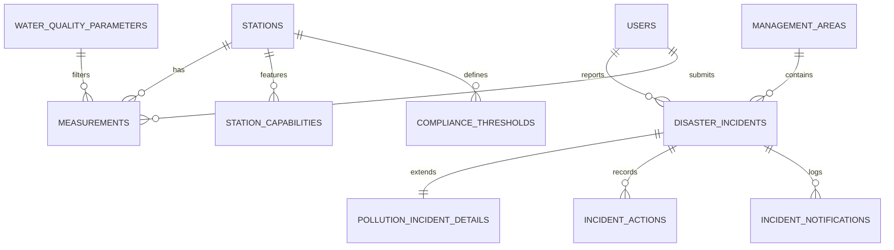

# Database & Schema Architecture

The INMACOM MIS utilizes a PostgreSQL relational database. This page explains the core schema design, primary key UUID conventions, relationships, and data seeding protocols.

---

## Core Domain Schema

The database consists of tables tracking monitoring stations, measurements, hazard states, compliance thresholds, and document library structures.



### Key Tables Reference

| Table Name | Primary Key | Description |
| :--- | :--- | :--- |
| `stations` | `id` (UUID) | River basin monitoring stations with GIS lat/long coordinates. |
| `measurements` | `id` (UUID) | Water flow, dam level, chemical concentration, and rainfall values. |
| `water_quality_parameters` | `id` (UUID) | Code and descriptions for parameters like DO, EC, pH, and Temperature. |
| `management_areas` | `id` (UUID) | Subcatchments or river basin segments across Mozambique, Eswatini, and SA. |
| `disaster_incidents` | `id` (UUID) | Logged disasters (floods, spills) with status and coordinates. |
| `iima_user_categories` | `id` (UUID) | Priority categories (Primary, Secondary, Agriculture) for water allocation. |
| `iima_allocations` | `id` (UUID) | Annual treaty allocations (million m³/annum) per subcatchment and country. |
| `iima_eflow_requirements` | `id` (UUID) | Minimum environmental flow requirements at transboundary points. |
| `folders` & `documents` | `id` (UUID) | Hierarchical document library metadata and storage references. |
| `audit_logs` | `id` (UUID) | Record of database mutations including actor, action, and before/after state. |

---

## UUID Primary Keys (`HasUuids`)

To ensure merge-safety and prevent sequential integer sniffing, all primary keys in INMACOM MIS use UUID v4 values.

### Migration Convention
When creating new database tables, define the primary key as a UUID:
```php
Schema::create('stations', function (Blueprint $table) {
    $table->uuid('id')->primary();
    $table->string('code')->unique();
    // ...
});
```

### Model Integration
Eloquent models must utilize the `Illuminate\Database\Eloquent\Concerns\HasUuids` trait. This automatically generates UUIDs when creating records:
```php
namespace App\Models;

use Illuminate\Database\Eloquent\Concerns\HasUuids;
use Illuminate\Database\Eloquent\Model;

class Station extends Model
{
    use HasUuids;

    // Disables auto-incrementing integers
    public $incrementing = false;
    protected $keyType = 'string';
}
```

---

## Polymorphic Relationships

Polymorphic tables allow a single model to belong to multiple parent models on a single association. In INMACOM MIS, **Comments** are linked polymorphically:

### The `comments` Table Schema
```php
Schema::create('comments', function (Blueprint $table) {
    $table->uuid('id')->primary();
    $table->uuid('actor_id');
    
    // Generates commentable_id (UUID) and commentable_type (string) columns
    $table->uuidMorphs('commentable'); 
    
    $table->text('content');
    $table->boolean('is_resolved')->default(false);
    $table->timestamps();
});
```
This enables comments to be appended seamlessly to:
*   `App\Models\Measurement` (e.g. review rejection notes)
*   `App\Models\Station` (general metadata reviews)
*   `App\Models\StationRevision` (review of proposed metadata revisions)
*   `App\Models\DisasterIncident` (incident logs and updates)

---

## Seeding Conventions

When extending treaty reference datasets (such as IIMA Appendix A allocations or REIWQ Appendix E parameters), **do not create ad-hoc database migrations**. Instead, add the new items to the labeled `TODO` blocks within:

`database/seeders/DDRIteration2ReferenceDataSeeder.php`

### Why this rule exists:
*   Reference datasets are static and must remain uniform across all environments.
*   By seeding all reference records from a single seeder, developers can reset and repopulate the database reliably.
*   Seed commands are run with the `--force` flag on staging deployments automatically.
